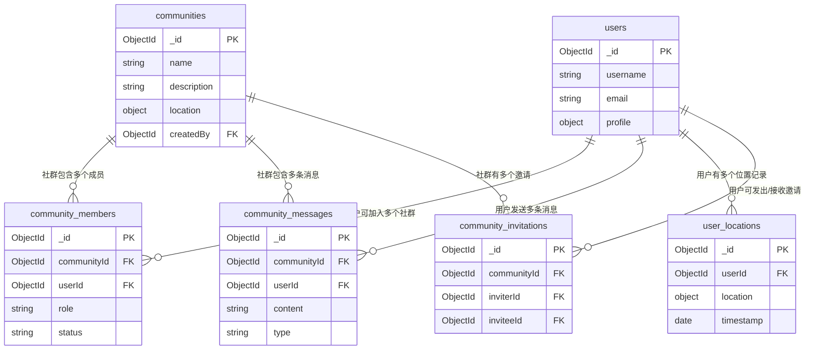

# 社群功能数据库设计

## 概述

本文档定义了AI健身教练应用中社群功能的数据库结构设计，包括社群管理、成员关系、消息系统和位置服务等核心数据模型。

## 数据库选择

**推荐数据库**: MongoDB (NoSQL)

**选择理由**:
- 灵活的文档结构，适合社群消息的多样化内容
- 优秀的地理位置查询支持 (GeoSpatial Queries)
- 水平扩展能力强，适合社群功能的高并发场景
- 与现有系统的MongoDB数据库保持一致

## 集合 (Collections) 设计

### 1. communities (社群集合)

```javascript
{
  _id: ObjectId,
  name: String,                    // 社群名称
  description: String,             // 社群描述
  avatar: String,                  // 社群头像 (emoji或图片URL)
  memberCount: Number,             // 成员数量
  maxMembers: Number,              // 最大成员数限制 (默认1000)
  isPublic: Boolean,               // 是否公开社群
  location: {
    type: "Point",                 // GeoJSON格式
    coordinates: [Number, Number], // [经度, 纬度]
    address: String,               // 详细地址
    city: String,                  // 城市
    district: String,              // 区域
    poi: String                    // 兴趣点名称
  },
  settings: {
    allowImageUpload: Boolean,     // 允许上传图片
    allowLocationShare: Boolean,   // 允许分享位置
    requireApproval: Boolean,      // 需要审批加入
    autoDeleteMessages: Boolean,   // 自动删除消息
    messageRetentionDays: Number   // 消息保留天数
  },
  tags: [String],                  // 社群标签
  category: String,                // 社群分类 (运动类型等)
  createdBy: ObjectId,             // 创建者用户ID
  createdAt: Date,
  updatedAt: Date,
  
  // 索引字段
  isActive: Boolean,               // 是否活跃
  lastActivityAt: Date             // 最后活动时间
}
```

**索引设计**:
```javascript
// 地理位置索引 (2dsphere)
db.communities.createIndex({ "location": "2dsphere" })

// 复合索引 - 公开社群按活跃度排序
db.communities.createIndex({ 
  "isPublic": 1, 
  "isActive": 1, 
  "lastActivityAt": -1 
})

// 文本搜索索引
db.communities.createIndex({ 
  "name": "text", 
  "description": "text", 
  "tags": "text" 
})

// 创建者索引
db.communities.createIndex({ "createdBy": 1 })
```

### 2. community_members (社群成员集合)

```javascript
{
  _id: ObjectId,
  communityId: ObjectId,           // 社群ID
  userId: ObjectId,                // 用户ID
  role: String,                    // 角色: "owner", "admin", "member"
  status: String,                  // 状态: "active", "pending", "banned", "left"
  joinedAt: Date,                  // 加入时间
  approvedBy: ObjectId,            // 审批人ID (如果需要审批)
  approvedAt: Date,                // 审批时间
  leftAt: Date,                    // 离开时间
  
  // 成员设置
  settings: {
    muteNotifications: Boolean,    // 静音通知
    allowDirectMessage: Boolean    // 允许私信
  },
  
  // 统计信息
  stats: {
    messageCount: Number,          // 发送消息数
    lastActiveAt: Date,            // 最后活跃时间
    joinCount: Number              // 加入次数 (重复加入)
  },
  
  createdAt: Date,
  updatedAt: Date
}
```

**索引设计**:
```javascript
// 复合索引 - 社群成员查询
db.community_members.createIndex({ 
  "communityId": 1, 
  "status": 1, 
  "role": 1 
})

// 用户社群查询
db.community_members.createIndex({ 
  "userId": 1, 
  "status": 1, 
  "joinedAt": -1 
})

// 唯一索引 - 防止重复加入
db.community_members.createIndex({ 
  "communityId": 1, 
  "userId": 1 
}, { unique: true })
```

### 3. community_messages (社群消息集合)

```javascript
{
  _id: ObjectId,
  communityId: ObjectId,           // 社群ID
  userId: ObjectId,                // 发送者用户ID
  content: String,                 // 消息内容
  type: String,                    // 消息类型: "text", "image", "location", "system"
  
  // 附件信息
  attachments: [{
    type: String,                  // "image", "file"
    url: String,                   // 文件URL
    filename: String,              // 原始文件名
    size: Number,                  // 文件大小 (bytes)
    mimeType: String,              // MIME类型
    metadata: {
      width: Number,               // 图片宽度
      height: Number,              // 图片高度
      duration: Number             // 视频/音频时长
    }
  }],
  
  // 位置信息
  location: {
    type: "Point",
    coordinates: [Number, Number], // [经度, 纬度]
    address: String,               // 地址描述
    accuracy: Number               // 精度 (米)
  },
  
  // 消息状态
  isEdited: Boolean,               // 是否已编辑
  editedAt: Date,                  // 编辑时间
  isDeleted: Boolean,              // 是否已删除
  deletedAt: Date,                 // 删除时间
  deletedBy: ObjectId,             // 删除者ID
  
  // 回复信息
  replyTo: ObjectId,               // 回复的消息ID
  
  // 系统消息信息
  systemData: {
    action: String,                // 系统动作: "join", "leave", "promote", etc.
    targetUserId: ObjectId,        // 目标用户ID
    metadata: Object               // 额外数据
  },
  
  createdAt: Date,
  updatedAt: Date
}
```

**索引设计**:
```javascript
// 社群消息时间序列查询
db.community_messages.createIndex({ 
  "communityId": 1, 
  "createdAt": -1 
})

// 用户消息查询
db.community_messages.createIndex({ 
  "userId": 1, 
  "createdAt": -1 
})

// 地理位置消息查询
db.community_messages.createIndex({ 
  "location": "2dsphere" 
})

// 回复消息查询
db.community_messages.createIndex({ "replyTo": 1 })

// TTL索引 - 自动删除过期消息 (可选)
db.community_messages.createIndex({ 
  "createdAt": 1 
}, { 
  expireAfterSeconds: 7776000  // 90天后自动删除
})
```

### 4. user_locations (用户位置集合)

```javascript
{
  _id: ObjectId,
  userId: ObjectId,                // 用户ID
  location: {
    type: "Point",
    coordinates: [Number, Number]  // [经度, 纬度]
  },
  accuracy: Number,                // 位置精度 (米)
  address: String,                 // 地址信息
  city: String,                    // 城市
  district: String,                // 区域
  
  // 位置来源
  source: String,                  // "gps", "network", "manual"
  
  // 隐私设置
  isPublic: Boolean,               // 是否公开位置
  shareWithCommunities: Boolean,   // 是否与社群分享
  
  // 时间信息
  timestamp: Date,                 // 位置时间戳
  createdAt: Date,
  updatedAt: Date
}
```

**索引设计**:
```javascript
// 地理位置索引
db.user_locations.createIndex({ "location": "2dsphere" })

// 用户位置查询 (保留最新位置)
db.user_locations.createIndex({ 
  "userId": 1, 
  "timestamp": -1 
})

// TTL索引 - 自动删除旧位置记录
db.user_locations.createIndex({ 
  "createdAt": 1 
}, { 
  expireAfterSeconds: 2592000  // 30天后自动删除
})
```

### 5. community_invitations (社群邀请集合)

```javascript
{
  _id: ObjectId,
  communityId: ObjectId,           // 社群ID
  inviterId: ObjectId,             // 邀请者ID
  inviteeId: ObjectId,             // 被邀请者ID
  inviteCode: String,              // 邀请码 (可选)
  message: String,                 // 邀请消息
  
  status: String,                  // 状态: "pending", "accepted", "declined", "expired"
  
  expiresAt: Date,                 // 过期时间
  respondedAt: Date,               // 响应时间
  
  createdAt: Date,
  updatedAt: Date
}
```

**索引设计**:
```javascript
// 被邀请者查询
db.community_invitations.createIndex({ 
  "inviteeId": 1, 
  "status": 1, 
  "createdAt": -1 
})

// 邀请码查询
db.community_invitations.createIndex({ "inviteCode": 1 })

// TTL索引 - 自动删除过期邀请
db.community_invitations.createIndex({ 
  "expiresAt": 1 
}, { 
  expireAfterSeconds: 0 
})
```

## 数据关系图



## 查询优化建议

### 1. 常用查询模式

**获取附近社群**:
```javascript
db.communities.find({
  location: {
    $near: {
      $geometry: { type: "Point", coordinates: [116.4074, 39.9042] },
      $maxDistance: 10000  // 10km
    }
  },
  isPublic: true,
  isActive: true
}).sort({ lastActivityAt: -1 }).limit(20)
```

**获取用户社群列表**:
```javascript
db.community_members.aggregate([
  { $match: { userId: ObjectId("..."), status: "active" } },
  { $lookup: {
      from: "communities",
      localField: "communityId",
      foreignField: "_id",
      as: "community"
  }},
  { $unwind: "$community" },
  { $sort: { joinedAt: -1 } }
])
```

**获取社群消息**:
```javascript
db.community_messages.find({
  communityId: ObjectId("..."),
  isDeleted: { $ne: true }
}).sort({ createdAt: -1 }).limit(50)
```

### 2. 性能优化策略

1. **分片策略**: 按 `communityId` 进行分片，确保同一社群的数据在同一分片
2. **读写分离**: 消息查询使用只读副本，减少主库压力
3. **缓存策略**: 
   - 热门社群信息缓存 (Redis)
   - 用户社群列表缓存
   - 最近消息缓存
4. **数据归档**: 定期归档旧消息和位置数据

### 3. 数据一致性

1. **成员计数**: 使用 MongoDB 事务确保 `memberCount` 的一致性
2. **消息计数**: 异步更新用户消息统计
3. **位置更新**: 使用 upsert 操作更新用户最新位置

## 安全考虑

1. **数据隐私**: 
   - 位置数据加密存储
   - 敏感消息内容加密
   - 用户权限严格控制

2. **访问控制**:
   - 社群成员验证
   - 消息发送权限检查
   - 位置信息访问权限

3. **数据清理**:
   - 定期清理已删除用户的数据
   - 自动删除过期的邀请和位置记录

## 扩展性考虑

1. **水平扩展**: 支持 MongoDB 分片集群
2. **垂直扩展**: 消息和位置数据可分离到不同集合
3. **多媒体存储**: 图片和文件存储到对象存储服务 (如 AWS S3)
4. **实时通信**: 集成 WebSocket 或消息队列服务

## 备份策略

1. **增量备份**: 每日增量备份
2. **全量备份**: 每周全量备份
3. **异地备份**: 关键数据异地存储
4. **恢复测试**: 定期进行数据恢复测试