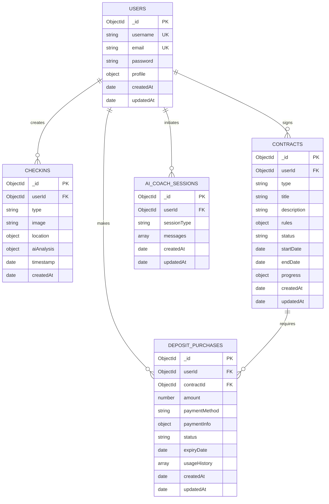

# AI健身教练 - 保证金管理系统数据库设计

## 数据库选型

**选择**: MongoDB (NoSQL 文档数据库)

**选择理由**:
- 灵活的文档结构，适合保证金记录的复杂数据结构
- 良好的水平扩展能力，支持大量用户数据
- 丰富的查询功能，支持复杂的统计分析
- 与 Node.js 生态系统集成良好

## 数据库配置

```javascript
// 连接配置
{
  host: 'localhost',
  port: 27017,
  database: 'fitness_coach',
  options: {
    useNewUrlParser: true,
    useUnifiedTopology: true,
    maxPoolSize: 10,
    serverSelectionTimeoutMS: 5000,
    socketTimeoutMS: 45000,
  }
}
```

## 集合设计

### 1. users (用户集合)

**用途**: 存储用户基本信息和个人资料

**文档结构**:
```javascript
{
  _id: ObjectId,
  username: String,        // 用户名，唯一
  email: String,          // 邮箱，唯一
  password: String,       // 加密后的密码
  profile: {              // 用户资料（可选）
    name: String,         // 真实姓名
    age: Number,          // 年龄
    height: Number,       // 身高（cm）
    weight: Number,       // 体重（kg）
    goal: String          // 健身目标
  },
  createdAt: Date,        // 创建时间
  updatedAt: Date         // 更新时间
}
```

**索引设计**:
```javascript
// 唯一索引
db.users.createIndex({ "email": 1 }, { unique: true })
db.users.createIndex({ "username": 1 }, { unique: true })

// 查询优化索引
db.users.createIndex({ "createdAt": 1 })
```

**约束条件**:
- `username`: 3-20字符，字母数字下划线
- `email`: 有效邮箱格式
- `password`: 最少6字符（存储时已加密）
- `profile.age`: 10-120
- `profile.height`: 50-300
- `profile.weight`: 20-500

### 2. checkins (打卡记录集合)

**用途**: 存储用户的各类打卡记录和AI分析结果

**文档结构**:
```javascript
{
  _id: ObjectId,
  userId: ObjectId,       // 关联用户ID
  type: String,           // 打卡类型: breakfast|lunch|dinner|workout|protein
  image: String,          // 图片URL或base64（可选）
  location: {             // 位置信息（可选）
    latitude: Number,     // 纬度
    longitude: Number,    // 经度
    address: String       // 地址描述
  },
  aiAnalysis: {           // AI分析结果（可选）
    foodItems: [String],  // 识别的食物列表
    healthScore: Number,  // 健康评分 (0-100)
    calories: Number,     // 卡路里
    nutritionInfo: {      // 营养信息
      protein: Number,    // 蛋白质 (g)
      carbs: Number,      // 碳水化合物 (g)
      fat: Number,        // 脂肪 (g)
      fiber: Number       // 纤维 (g)
    },
    recommendations: [String], // AI建议
    description: String   // 分析描述
  },
  timestamp: Date,        // 打卡时间
  createdAt: Date         // 记录创建时间
}
```

**索引设计**:
```javascript
// 用户查询索引
db.checkins.createIndex({ "userId": 1 })
db.checkins.createIndex({ "userId": 1, "timestamp": -1 })

// 时间范围查询索引
db.checkins.createIndex({ "timestamp": -1 })

// 类型筛选索引
db.checkins.createIndex({ "type": 1 })

// 复合查询索引
db.checkins.createIndex({ "userId": 1, "type": 1, "timestamp": -1 })

// 地理位置索引（如果需要地理查询）
db.checkins.createIndex({ "location": "2dsphere" })
```

### 3. contracts (契约集合)

**用途**: 存储用户的健身契约和进度跟踪

**文档结构**:
```javascript
{
  _id: ObjectId,
  userId: ObjectId,       // 关联用户ID
  type: String,           // 契约类型: normal|hero
  title: String,          // 契约标题
  description: String,    // 契约描述
  rules: {                // 契约规则
    dailyCheckIns: Number,  // 每日需要打卡次数
    penaltyAmount: Number,  // 违约金额
    duration: Number        // 持续天数
  },
  status: String,         // 状态: active|completed|failed
  startDate: Date,        // 开始日期
  endDate: Date,          // 结束日期
  progress: {             // 进度跟踪
    completedDays: Number,    // 已完成天数
    totalPenalty: Number,     // 累计罚金
    checkInHistory: [Date]    // 打卡历史日期
  },
  createdAt: Date,        // 创建时间
  updatedAt: Date         // 更新时间
}
```

### 4. deposit_purchases (保证金购买记录集合)

**用途**: 存储用户的保证金购买记录和支付信息

**文档结构**:
```javascript
{
  _id: ObjectId,
  userId: ObjectId,       // 关联用户ID
  contractId: ObjectId,   // 关联契约ID（可选，如果是为特定契约购买）
  amount: Number,         // 保证金金额
  paymentMethod: String,  // 支付方式: wechat|alipay|bank_card
  paymentInfo: {          // 支付信息
    transactionId: String,  // 第三方支付交易ID
    paymentTime: Date,      // 支付时间
    paymentStatus: String,  // 支付状态: pending|success|failed|refunded
    refundInfo: {           // 退款信息（可选）
      refundId: String,     // 退款ID
      refundTime: Date,     // 退款时间
      refundAmount: Number, // 退款金额
      refundReason: String  // 退款原因
    }
  },
  status: String,         // 记录状态: active|used|refunded|expired
  expiryDate: Date,       // 过期时间（可选）
  usageHistory: [         // 使用历史
    {
      contractId: ObjectId, // 使用的契约ID
      usedAmount: Number,   // 使用金额
      usedTime: Date,       // 使用时间
      reason: String        // 使用原因: penalty|refund
    }
  ],
  createdAt: Date,        // 创建时间
  updatedAt: Date         // 更新时间
}
```

**索引设计**:
```javascript
// 用户查询索引
db.contracts.createIndex({ "userId": 1 })
db.contracts.createIndex({ "userId": 1, "status": 1 })

// 状态查询索引
db.contracts.createIndex({ "status": 1 })

// 时间范围查询索引
db.contracts.createIndex({ "startDate": 1, "endDate": 1 })

// 类型筛选索引
db.contracts.createIndex({ "type": 1 })
```

**索引设计**:
```javascript
// 用户查询索引
db.deposit_purchases.createIndex({ "userId": 1 })
db.deposit_purchases.createIndex({ "userId": 1, "status": 1 })

// 契约关联索引
db.deposit_purchases.createIndex({ "contractId": 1 })

// 支付状态索引
db.deposit_purchases.createIndex({ "paymentInfo.paymentStatus": 1 })

// 交易ID索引（用于支付回调查询）
db.deposit_purchases.createIndex({ "paymentInfo.transactionId": 1 }, { unique: true, sparse: true })

// 时间查询索引
db.deposit_purchases.createIndex({ "createdAt": -1 })
db.deposit_purchases.createIndex({ "paymentInfo.paymentTime": -1 })

// 过期时间索引
db.deposit_purchases.createIndex({ "expiryDate": 1 }, { sparse: true })
```

### 5. ai_coach_sessions (AI教练会话集合)

**用途**: 存储用户与AI教练的对话历史

**文档结构**:
```javascript
{
  _id: ObjectId,
  userId: ObjectId,       // 关联用户ID
  sessionType: String,    // 会话类型: general|nutrition|workout|motivation
  messages: [             // 消息列表
    {
      role: String,       // 角色: user|assistant
      content: String,    // 消息内容
      timestamp: Date     // 消息时间
    }
  ],
  createdAt: Date,        // 会话创建时间
  updatedAt: Date         // 最后更新时间
}
```

**索引设计**:
```javascript
// 用户查询索引
db.ai_coach_sessions.createIndex({ "userId": 1 })
db.ai_coach_sessions.createIndex({ "userId": 1, "updatedAt": -1 })

// 会话类型索引
db.ai_coach_sessions.createIndex({ "sessionType": 1 })

// 时间排序索引
db.ai_coach_sessions.createIndex({ "updatedAt": -1 })
```

## 数据关系图



## 数据完整性约束

### 引用完整性
- 所有集合中的 `userId` 字段必须引用 `users` 集合中的有效 `_id`
- `deposit_purchases` 集合中的 `contractId` 字段必须引用 `contracts` 集合中的有效 `_id`
- 删除用户时，需要级联删除相关的打卡记录、契约、保证金记录和AI会话
- 删除契约时，需要检查相关的保证金记录状态

### 数据验证规则
```javascript
// 用户集合验证
db.createCollection("users", {
  validator: {
    $jsonSchema: {
      bsonType: "object",
      required: ["username", "email", "password", "createdAt"],
      properties: {
        username: {
          bsonType: "string",
          minLength: 3,
          maxLength: 20,
          pattern: "^[a-zA-Z0-9_]+$"
        },
        email: {
          bsonType: "string",
          pattern: "^[a-zA-Z0-9._%+-]+@[a-zA-Z0-9.-]+\\.[a-zA-Z]{2,}$"
        },
        password: {
          bsonType: "string",
          minLength: 6
        }
      }
    }
  }
});

// 打卡记录验证
db.createCollection("checkins", {
  validator: {
    $jsonSchema: {
      bsonType: "object",
      required: ["userId", "type", "timestamp", "createdAt"],
      properties: {
        type: {
          enum: ["breakfast", "lunch", "dinner", "workout", "protein"]
        },
        "aiAnalysis.healthScore": {
          bsonType: "number",
          minimum: 0,
          maximum: 100
        }
      }
    }
  }
});

// 保证金购买记录验证
db.createCollection("deposit_purchases", {
  validator: {
    $jsonSchema: {
      bsonType: "object",
      required: ["userId", "amount", "paymentMethod", "paymentInfo", "status", "createdAt"],
      properties: {
        amount: {
          bsonType: "number",
          minimum: 0
        },
        paymentMethod: {
          enum: ["wechat", "alipay", "bank_card"]
        },
        "paymentInfo.paymentStatus": {
          enum: ["pending", "success", "failed", "refunded"]
        },
        status: {
          enum: ["active", "used", "refunded", "expired"]
        }
      }
    }
  }
});
```

## 性能优化策略

### 1. 索引优化
- 为常用查询字段创建复合索引
- 定期分析查询性能，优化索引策略
- 使用部分索引减少索引大小

### 2. 数据分片策略
```javascript
// 基于用户ID进行分片
sh.shardCollection("fitness_coach.checkins", { "userId": 1 })
sh.shardCollection("fitness_coach.contracts", { "userId": 1 })
sh.shardCollection("fitness_coach.deposit_purchases", { "userId": 1 })
sh.shardCollection("fitness_coach.ai_coach_sessions", { "userId": 1 })
```

### 3. 数据归档
- 定期归档超过1年的打卡记录
- 压缩历史AI对话数据
- 实施数据生命周期管理

### 4. 缓存策略
- 用户基本信息缓存（Redis）
- 热点数据缓存（最近的打卡记录）
- 查询结果缓存（统计数据）

## 备份和恢复策略

### 1. 备份策略
```bash
# 每日全量备份
mongodump --host localhost:27017 --db fitness_coach --out /backup/daily/$(date +%Y%m%d)

# 每小时增量备份（使用oplog）
mongodump --host localhost:27017 --oplog --out /backup/incremental/$(date +%Y%m%d_%H)
```

### 2. 恢复策略
```bash
# 恢复全量备份
mongorestore --host localhost:27017 --db fitness_coach /backup/daily/20240101/fitness_coach

# 恢复到指定时间点
mongorestore --host localhost:27017 --oplogReplay --oplogLimit 1609459200:1 /backup/incremental/
```

## 监控和维护

### 1. 性能监控
- 查询执行时间监控
- 索引使用率分析
- 连接池状态监控
- 磁盘空间使用监控

### 2. 数据质量监控
- 数据完整性检查
- 异常数据检测
- 数据一致性验证

### 3. 定期维护任务
- 索引重建和优化
- 数据压缩和清理
- 统计信息更新
- 性能基准测试

## 安全考虑

### 1. 访问控制
```javascript
// 创建应用用户
db.createUser({
  user: "fitness_app",
  pwd: "secure_password",
  roles: [
    { role: "readWrite", db: "fitness_coach" }
  ]
});

// 创建只读用户（用于报表）
db.createUser({
  user: "fitness_readonly",
  pwd: "readonly_password",
  roles: [
    { role: "read", db: "fitness_coach" }
  ]
});
```

### 2. 数据加密
- 启用传输层加密（TLS/SSL）
- 敏感字段加密存储
- 定期轮换加密密钥

### 3. 审计日志
- 启用数据库操作审计
- 记录敏感操作日志
- 定期审查访问日志

这个数据库设计方案提供了灵活性、可扩展性和高性能，能够满足健身教练应用的各种需求。