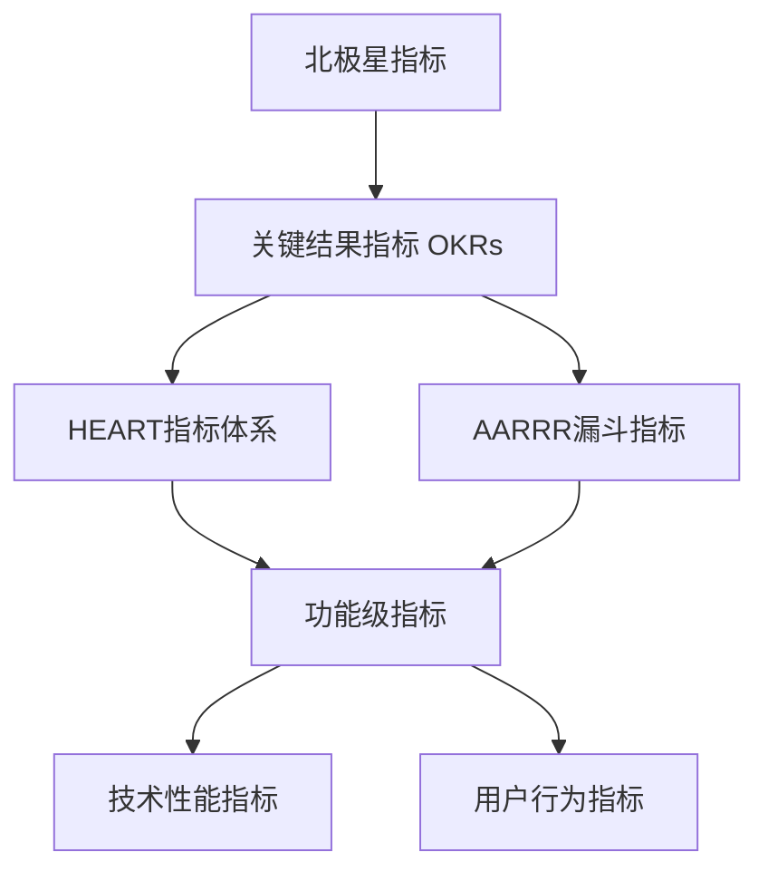
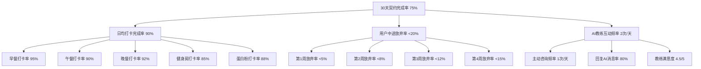
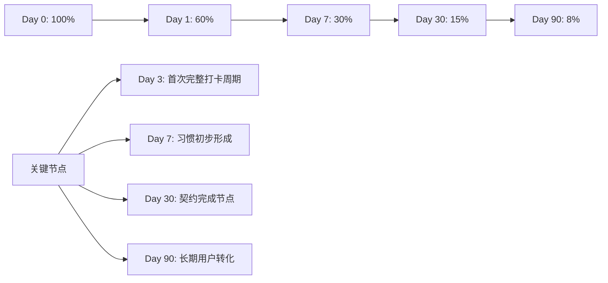
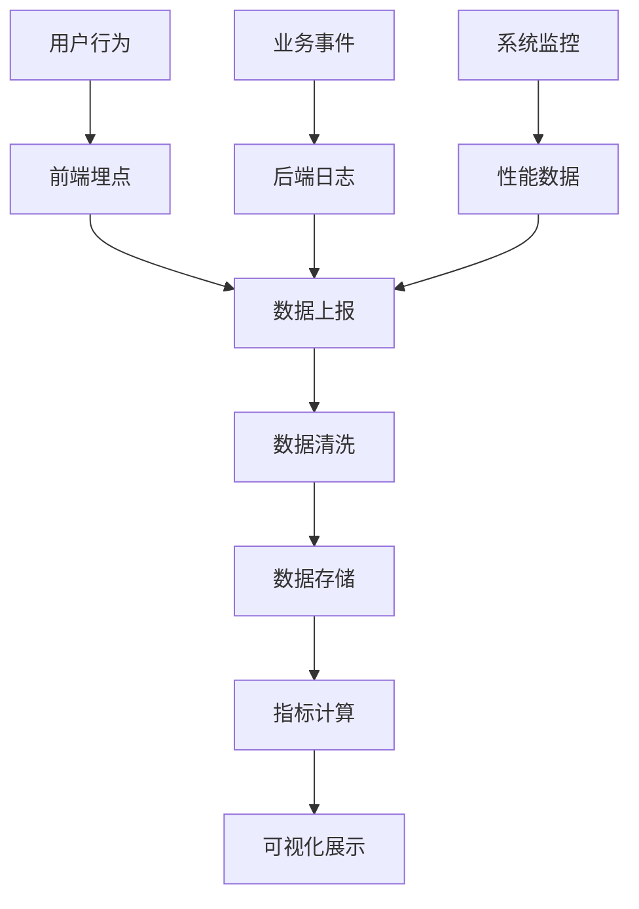
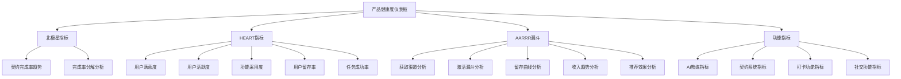
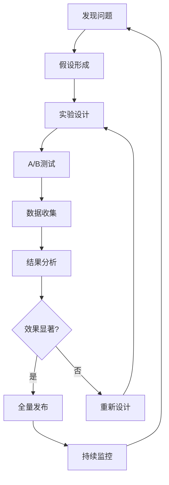

# 健身契约 - 产品评估指标框架 (Metrics Framework)

## 1. 指标框架概述

### 1.1 指标框架目的
建立全面、科学的产品评估指标体系，帮助团队：
- 客观评估产品健康度和用户价值
- 及时发现问题并指导产品优化
- 支持数据驱动的产品决策
- 衡量产品目标达成情况

### 1.2 指标设计原则
- **可衡量性**: 所有指标都能准确量化
- **可操作性**: 指标变化能指导具体行动
- **相关性**: 指标与产品目标和用户价值直接相关
- **平衡性**: 兼顾短期和长期、用户和商业价值
- **简洁性**: 核心指标数量适中，易于理解和跟踪

### 1.3 指标分层体系

## 2. 北极星指标定义

### 2.1 北极星指标选择

**北极星指标**: **用户30天契约完成率**

### 2.2 选择依据

#### 2.2.1 价值对齐性
- **用户价值**: 完成契约意味着用户成功建立了健身习惯，获得了真正的价值
- **商业价值**: 高完成率带来用户满意度、口碑传播和复购意愿
- **产品价值**: 体现产品核心功能的有效性

#### 2.2.2 可操作性
- 可以通过优化AI教练、打卡体验、社交功能等提升完成率
- 能够指导产品功能优先级决策
- 可以分解为具体的行动计划

#### 2.2.3 长期导向
- 关注用户真正的行为改变，而非虚荣指标
- 平衡用户成功和商业成功
- 具有可持续性和成长性

### 2.3 北极星指标目标设定

| 时间节点 | 目标值 | 基准说明 |
|----------|--------|----------|
| MVP阶段 | 60% | 验证核心假设的最低标准 |
| 正式版 | 65% | 功能完善后的提升目标 |
| 成熟期 | 75% | 行业领先水平目标 |
| 长期目标 | 80% | 产品优化的终极目标 |

### 2.4 北极星指标分解

## 3. HEART指标体系详述

### 3.1 HEART框架说明
HEART是Google提出的用户体验指标框架：
- **H**appiness (快乐度): 用户满意度和情感体验
- **E**ngagement (参与度): 用户活跃度和使用深度
- **A**doption (采用度): 新功能的采用情况
- **R**etention (留存度): 用户回访和持续使用
- **T**ask Success (任务成功): 用户完成关键任务的效率

### 3.2 Happiness (快乐度) 指标

#### 3.2.1 核心指标
| 指标名称 | 定义 | 目标值 | 数据来源 |
|----------|------|--------|----------|
| 整体满意度 | 用户对产品的整体评分 | >4.0/5.0 | 应用商店评分+内置调研 |
| AI教练满意度 | 用户对AI教练的满意度 | >4.2/5.0 | 功能内评分 |
| 契约机制满意度 | 用户对契约设计的认可度 | >3.8/5.0 | 专项调研 |
| 推荐意愿 | 用户向朋友推荐的意愿 | >70% | NPS调研 |

#### 3.2.2 情感指标
| 指标名称 | 定义 | 目标值 | 数据来源 |
|----------|------|--------|----------|
| 成就感指数 | 用户完成任务的成就感 | >4.0/5.0 | 打卡后情感调研 |
| 压力感知度 | 用户感受到的压力程度 | 3.0-3.5/5.0 | 定期情感调研 |
| 社交满足感 | 通过社交功能获得的满足感 | >3.8/5.0 | 社交功能调研 |

#### 3.2.3 监测方法
- **应用内评分**: 关键操作后弹出评分请求
- **定期调研**: 每月进行用户满意度调研
- **应用商店监控**: 实时监控评分和评论
- **用户访谈**: 深度了解用户情感体验

### 3.3 Engagement (参与度) 指标

#### 3.3.1 活跃度指标
| 指标名称 | 定义 | 目标值 | 计算方法 |
|----------|------|--------|----------|
| 日活跃用户(DAU) | 每日活跃用户数 | 月增长>15% | 当日启动应用的用户数 |
| 月活跃用户(MAU) | 每月活跃用户数 | 月增长>10% | 当月启动应用的用户数 |
| 活跃度比率 | DAU/MAU比率 | >25% | DAU除以MAU |
| 会话时长 | 用户单次使用时长 | >8分钟 | 从启动到退出的时间 |

#### 3.3.2 使用深度指标
| 指标名称 | 定义 | 目标值 | 计算方法 |
|----------|------|--------|----------|
| 日均打卡次数 | 用户每日平均打卡次数 | >3次 | 总打卡次数/活跃用户数 |
| AI对话频率 | 用户与AI教练对话频率 | >2次/天 | 对话次数/活跃用户数 |
| 功能使用广度 | 用户使用功能的种类数 | >5个 | 用户使用的功能模块数 |
| 社交互动频率 | 用户社交功能使用频率 | >1次/天 | 社交操作次数/活跃用户数 |

#### 3.3.3 内容消费指标
| 指标名称 | 定义 | 目标值 | 计算方法 |
|----------|------|--------|----------|
| 进度查看频率 | 用户查看进度的频率 | >1次/天 | 进度页面访问次数 |
| 分享频率 | 用户分享内容的频率 | >2次/周 | 分享操作次数 |
| 教练定制率 | 用户自定义AI教练的比例 | >80% | 定制用户数/总用户数 |

### 3.4 Adoption (采用度) 指标

#### 3.4.1 新用户采用指标
| 指标名称 | 定义 | 目标值 | 计算方法 |
|----------|------|--------|----------|
| 注册完成率 | 完成注册流程的用户比例 | >85% | 完成注册用户/开始注册用户 |
| 首次契约创建率 | 新用户创建首个契约的比例 | >70% | 创建契约用户/注册用户 |
| 首日打卡率 | 新用户首日完成打卡的比例 | >60% | 首日打卡用户/创建契约用户 |
| 新手引导完成率 | 完成新手引导的用户比例 | >90% | 完成引导用户/开始引导用户 |

#### 3.4.2 新功能采用指标
| 指标名称 | 定义 | 目标值 | 计算方法 |
|----------|------|--------|----------|
| 社交功能采用率 | 使用社交功能的用户比例 | >40% | 使用社交功能用户/总用户 |
| 团队契约参与率 | 参与团队契约的用户比例 | >25% | 参与团队用户/总用户 |
| 高级功能使用率 | 使用付费功能的用户比例 | >15% | 付费用户/总用户 |
| AI教练定制率 | 自定义AI教练的用户比例 | >80% | 定制教练用户/总用户 |

#### 3.4.3 功能渗透率
| 功能模块 | 目标渗透率 | 当前值 | 提升策略 |
|----------|------------|--------|----------|
| 基础打卡 | 95% | - | 核心功能，重点优化 |
| AI教练对话 | 80% | - | 增强引导和价值感知 |
| 社交监督 | 40% | - | 优化邀请流程 |
| 数据分析 | 60% | - | 提升数据可视化 |
| 成果分享 | 50% | - | 简化分享流程 |

### 3.5 Retention (留存度) 指标

#### 3.5.1 时间维度留存
| 指标名称 | 定义 | 目标值 | 行业基准 |
|----------|------|--------|----------|
| 次日留存率 | 注册后第2天仍活跃的用户比例 | >60% | 健身类40-60% |
| 7日留存率 | 注册后第7天仍活跃的用户比例 | >30% | 健身类20-35% |
| 30日留存率 | 注册后第30天仍活跃的用户比例 | >15% | 健身类10-20% |
| 90日留存率 | 注册后第90天仍活跃的用户比例 | >8% | 健身类5-12% |

#### 3.5.2 行为维度留存
| 指标名称 | 定义 | 目标值 | 计算方法 |
|----------|------|--------|----------|
| 契约续约率 | 完成契约后创建新契约的比例 | >50% | 续约用户/完成契约用户 |
| 连续打卡留存 | 连续打卡7天以上的用户比例 | >40% | 连续打卡用户/总用户 |
| 社交留存率 | 有社交互动的用户留存率 | >45% | 社交用户30日留存率 |
| 付费用户留存 | 付费用户的留存率 | >70% | 付费用户30日留存率 |

#### 3.5.3 留存曲线分析

### 3.6 Task Success (任务成功) 指标

#### 3.6.1 核心任务成功率
| 任务名称 | 定义 | 目标值 | 失败原因分析 |
|----------|------|--------|-------------|
| 注册任务成功率 | 用户成功完成注册的比例 | >95% | 验证码、网络、流程复杂度 |
| 契约创建成功率 | 用户成功创建契约的比例 | >90% | 支付失败、规则理解 |
| 打卡任务成功率 | 用户成功完成打卡的比例 | >85% | AI识别、网络、操作复杂度 |
| 支付任务成功率 | 用户成功完成支付的比例 | >98% | 支付渠道、网络、余额 |

#### 3.6.2 任务完成效率
| 任务名称 | 目标完成时间 | 当前平均时间 | 优化目标 |
|----------|-------------|-------------|----------|
| 注册流程 | <2分钟 | - | 减少步骤，优化验证 |
| 契约创建 | <3分钟 | - | 简化选择，清晰说明 |
| 单次打卡 | <30秒 | - | 优化拍照，提升识别速度 |
| AI教练设置 | <5分钟 | - | 提供模板，简化定制 |

#### 3.6.3 错误率指标
| 错误类型 | 目标错误率 | 监控方法 | 改进措施 |
|----------|------------|----------|----------|
| AI识别错误 | <10% | 用户反馈+人工抽检 | 优化算法，增加训练数据 |
| 支付失败 | <2% | 支付日志监控 | 优化支付流程，增加重试 |
| 定位错误 | <5% | GPS精度监控 | 优化定位算法，增加备选方案 |
| 系统崩溃 | <0.1% | 崩溃日志收集 | 代码优化，异常处理 |

## 4. AARRR漏斗指标

### 4.1 AARRR框架说明
AARRR是海盗指标模型，关注用户生命周期：
- **A**cquisition (获取): 用户如何发现并下载产品
- **A**ctivation (激活): 用户首次体验产品价值
- **R**etention (留存): 用户持续使用产品
- **R**evenue (收入): 用户为产品付费
- **R**eferral (推荐): 用户推荐产品给他人

### 4.2 Acquisition (获取) 指标

#### 4.2.1 渠道获取指标
| 渠道类型 | 目标占比 | 获取成本 | 质量评分 |
|----------|----------|----------|----------|
| 应用商店自然搜索 | 40% | 免费 | 高 |
| 社交媒体推广 | 25% | 中等 | 中 |
| 朋友推荐分享 | 20% | 免费 | 高 |
| 线上广告投放 | 10% | 高 | 中 |
| 其他渠道 | 5% | 变动 | 低 |

#### 4.2.2 获取效率指标
| 指标名称 | 定义 | 目标值 | 计算方法 |
|----------|------|--------|----------|
| 下载转化率 | 应用商店页面访问到下载的转化率 | >15% | 下载数/页面访问数 |
| 获客成本(CAC) | 获得一个新用户的平均成本 | <50元 | 推广费用/新增用户数 |
| 渠道质量指数 | 不同渠道用户的质量评分 | >3.5/5.0 | 留存率+付费率综合评分 |
| 病毒系数(K值) | 每个用户平均带来的新用户数 | >0.3 | 推荐成功数/推荐用户数 |

### 4.3 Activation (激活) 指标

#### 4.3.1 激活定义
**激活标准**: 用户在注册后7天内完成以下关键行为：
1. 完成个人资料设置
2. 创建AI教练
3. 创建首个契约
4. 完成至少3次打卡

#### 4.3.2 激活漏斗指标
| 激活步骤 | 目标转化率 | 当前值 | 优化重点 |
|----------|------------|--------|----------|
| 下载→注册 | >80% | - | 简化注册流程 |
| 注册→完善资料 | >90% | - | 强化引导价值 |
| 完善资料→创建教练 | >85% | - | 提升趣味性 |
| 创建教练→创建契约 | >75% | - | 降低门槛 |
| 创建契约→首次打卡 | >70% | - | 及时引导 |

#### 4.3.3 激活时间指标
| 时间节点 | 激活率目标 | 关键行为 |
|----------|------------|----------|
| 24小时内 | >40% | 完成基础设置 |
| 72小时内 | >60% | 创建首个契约 |
| 7天内 | >70% | 完成激活定义 |

### 4.4 Retention (留存) 指标
*详见3.5节HEART框架中的留存指标*

### 4.5 Revenue (收入) 指标

#### 4.5.1 收入结构指标
| 收入来源 | 目标占比 | 单价范围 | 增长目标 |
|----------|----------|----------|----------|
| 契约违约金 | 60% | 3-9元/次 | 月增长20% |
| 高级功能订阅 | 25% | 30-98元/月 | 月增长30% |
| AI教练定制 | 10% | 19-49元/次 | 月增长25% |
| 广告合作 | 5% | 变动 | 月增长15% |

#### 4.5.2 用户价值指标
| 指标名称 | 定义 | 目标值 | 计算方法 |
|----------|------|--------|----------|
| 用户生命周期价值(LTV) | 用户在整个生命周期的价值 | >200元 | 平均月收入×平均生命周期 |
| 平均每用户收入(ARPU) | 每个用户的平均收入 | >30元/月 | 总收入/活跃用户数 |
| 付费用户比例 | 付费用户占总用户的比例 | >25% | 付费用户数/总用户数 |
| 付费转化率 | 免费用户转为付费用户的比例 | >20% | 新增付费用户/新增用户 |

#### 4.5.3 收入健康度指标
| 指标名称 | 定义 | 目标值 | 监控频率 |
|----------|------|--------|----------|
| 月经常性收入(MRR) | 每月可预期的经常性收入 | 月增长>25% | 每日 |
| 收入集中度 | 头部用户贡献收入的比例 | <30% | 每周 |
| 退款率 | 用户申请退款的比例 | <5% | 每日 |
| 收入预测准确度 | 收入预测与实际的偏差 | <10% | 每月 |

### 4.6 Referral (推荐) 指标

#### 4.6.1 推荐行为指标
| 指标名称 | 定义 | 目标值 | 计算方法 |
|----------|------|--------|----------|
| 推荐率 | 主动推荐产品的用户比例 | >30% | 推荐用户数/总用户数 |
| 推荐成功率 | 推荐导致新用户注册的比例 | >15% | 推荐成功数/推荐次数 |
| 病毒循环时间 | 从推荐到新用户激活的时间 | <24小时 | 平均推荐转化时间 |
| 推荐质量指数 | 推荐用户的质量评分 | >4.0/5.0 | 推荐用户留存率+活跃度 |

#### 4.6.2 社交传播指标
| 指标名称 | 定义 | 目标值 | 计算方法 |
|----------|------|--------|----------|
| 分享频率 | 用户分享内容的频率 | >2次/周 | 分享次数/活跃用户数 |
| 分享转化率 | 分享内容带来新用户的比例 | >5% | 分享转化数/分享次数 |
| 社交媒体提及 | 在社交媒体被提及的次数 | 月增长>20% | 社交媒体监控 |
| 用户生成内容 | 用户主动创作的内容数量 | >100条/月 | UGC内容统计 |

## 5. 功能级评估指标

### 5.1 AI教练功能指标

#### 5.1.1 使用指标
| 指标名称 | 目标值 | 当前值 | 监控方法 |
|----------|--------|--------|----------|
| AI教练使用率 | >80% | - | 用户行为埋点 |
| 日均对话次数 | >2次 | - | 对话日志统计 |
| 对话完成率 | >85% | - | 对话流程分析 |
| 教练满意度 | >4.2/5.0 | - | 功能内评分 |

#### 5.1.2 质量指标
| 指标名称 | 目标值 | 当前值 | 评估方法 |
|----------|--------|--------|----------|
| 回复相关性 | >85% | - | 人工评估+用户反馈 |
| 回复速度 | <3秒 | - | 系统性能监控 |
| 个性化程度 | >4.0/5.0 | - | 用户体验调研 |
| 建议有效性 | >75% | - | 用户采纳率统计 |

### 5.2 契约系统指标

#### 5.2.1 业务指标
| 指标名称 | 目标值 | 当前值 | 计算方法 |
|----------|--------|--------|----------|
| 契约创建率 | >70% | - | 创建契约用户/注册用户 |
| 契约完成率 | >75% | - | 完成契约数/创建契约数 |
| 平均契约金额 | >50元 | - | 总契约金额/契约数量 |
| 续约率 | >50% | - | 续约用户/完成用户 |

#### 5.2.2 风险指标
| 指标名称 | 目标值 | 当前值 | 监控方法 |
|----------|--------|--------|----------|
| 争议申诉率 | <5% | - | 客服系统统计 |
| 恶意违约率 | <2% | - | 行为模式分析 |
| 退款申请率 | <3% | - | 财务系统统计 |
| 系统判定准确率 | >98% | - | 人工抽检验证 |

### 5.3 打卡功能指标

#### 5.3.1 使用指标
| 指标名称 | 目标值 | 当前值 | 监控方法 |
|----------|--------|--------|----------|
| 日均打卡次数 | >3次 | - | 打卡行为统计 |
| 打卡成功率 | >90% | - | 成功次数/尝试次数 |
| 打卡及时率 | >80% | - | 按时打卡次数/总次数 |
| 连续打卡率 | >60% | - | 连续打卡用户比例 |

#### 5.3.2 技术指标
| 指标名称 | 目标值 | 当前值 | 监控方法 |
|----------|--------|--------|----------|
| AI识别准确率 | >90% | - | 人工验证+用户反馈 |
| 图片上传成功率 | >98% | - | 上传日志分析 |
| 定位精度 | >95% | - | GPS数据分析 |
| 打卡响应时间 | <5秒 | - | 性能监控 |

### 5.4 社交功能指标

#### 5.4.1 参与指标
| 指标名称 | 目标值 | 当前值 | 计算方法 |
|----------|--------|--------|----------|
| 社交功能使用率 | >40% | - | 使用社交功能用户/总用户 |
| 好友邀请成功率 | >30% | - | 接受邀请数/发送邀请数 |
| 团队契约参与率 | >25% | - | 参与团队用户/总用户 |
| 社交互动频率 | >1次/天 | - | 互动次数/活跃用户 |

#### 5.4.2 效果指标
| 指标名称 | 目标值 | 当前值 | 评估方法 |
|----------|--------|--------|----------|
| 社交用户留存率 | >45% | - | 社交用户30日留存 |
| 社交用户完成率 | >80% | - | 社交用户契约完成率 |
| 分享转化率 | >5% | - | 分享带来的新用户 |
| 社交满意度 | >4.0/5.0 | - | 功能满意度调研 |

## 6. 指标监测计划

### 6.1 监测频率设定

#### 6.1.1 实时监控指标 (24/7)
- 系统可用性和性能指标
- 支付交易成功率
- 应用崩溃率
- 关键API响应时间

#### 6.1.2 日度监控指标
- 日活跃用户数(DAU)
- 新用户注册数
- 契约创建数
- 打卡完成数
- 收入数据

#### 6.1.3 周度监控指标
- 7日留存率
- 功能使用率
- 用户反馈汇总
- 竞品动态分析

#### 6.1.4 月度监控指标
- 月活跃用户数(MAU)
- 30日留存率
- 用户满意度调研
- 商业指标分析

### 6.2 数据收集方法

#### 6.2.1 埋点数据收集

#### 6.2.2 关键埋点事件
| 事件类型 | 事件名称 | 参数 | 触发时机 |
|----------|----------|------|----------|
| 用户行为 | user_register | user_id, channel | 用户注册成功 |
| 用户行为 | contract_create | user_id, type, amount | 创建契约 |
| 用户行为 | checkin_complete | user_id, type, result | 完成打卡 |
| 用户行为 | ai_chat | user_id, message_count | AI对话 |
| 业务事件 | payment_success | user_id, amount, method | 支付成功 |
| 业务事件 | contract_complete | user_id, result, refund | 契约完成 |

#### 6.2.3 用户调研计划
| 调研类型 | 频率 | 样本量 | 调研内容 |
|----------|------|--------|----------|
| 满意度调研 | 月度 | 200-500人 | 整体满意度、功能评价 |
| 深度访谈 | 季度 | 20-30人 | 用户体验、需求洞察 |
| 可用性测试 | 新功能上线 | 10-15人 | 功能易用性测试 |
| NPS调研 | 季度 | 500-1000人 | 推荐意愿调研 |

### 6.3 数据分析与报告

#### 6.3.1 数据仪表板设计

#### 6.3.2 报告输出计划
| 报告类型 | 频率 | 受众 | 内容重点 |
|----------|------|------|----------|
| 实时监控大屏 | 实时 | 技术团队 | 系统状态、关键指标 |
| 日报 | 每日 | 产品团队 | 核心指标、异常预警 |
| 周报 | 每周 | 管理层 | 趋势分析、问题总结 |
| 月报 | 每月 | 全公司 | 全面分析、策略建议 |
| 季报 | 每季度 | 投资人/董事会 | 业务成果、战略调整 |

### 6.4 预警机制设计

#### 6.4.1 预警级别定义
| 预警级别 | 触发条件 | 响应时间 | 处理流程 |
|----------|----------|----------|----------|
| 紧急 | 系统崩溃、支付异常 | 5分钟内 | 立即处理、紧急修复 |
| 重要 | 核心指标异常下降 | 30分钟内 | 分析原因、制定方案 |
| 一般 | 次要指标波动 | 2小时内 | 持续观察、定期评估 |
| 提醒 | 趋势性变化 | 24小时内 | 记录分析、优化建议 |

#### 6.4.2 关键指标预警阈值
| 指标名称 | 预警阈值 | 预警级别 | 处理措施 |
|----------|----------|----------|----------|
| 契约完成率 | 下降>10% | 重要 | 分析原因、优化功能 |
| 日活跃用户 | 下降>20% | 重要 | 检查推广、分析流失 |
| 支付成功率 | <95% | 紧急 | 检查支付系统 |
| 应用崩溃率 | >0.5% | 紧急 | 紧急修复、回滚版本 |
| 用户满意度 | <3.5/5.0 | 重要 | 用户调研、体验优化 |

## 7. 指标优化策略

### 7.1 北极星指标优化策略

#### 7.1.1 提升契约完成率的策略
| 策略方向 | 具体措施 | 预期效果 | 实施优先级 |
|----------|----------|----------|------------|
| 降低任务难度 | 个性化任务设定、渐进式难度 | +5% | 高 |
| 增强动力机制 | 改进AI教练激励、社交压力 | +8% | 高 |
| 优化用户体验 | 简化打卡流程、提升识别准确率 | +3% | 中 |
| 完善支持系统 | 客服响应、争议处理 | +2% | 中 |

#### 7.1.2 分阶段优化目标
| 时间阶段 | 当前完成率 | 目标完成率 | 主要优化措施 |
|----------|------------|------------|-------------|
| Q1 | 基准值 | +5% | AI教练优化、流程简化 |
| Q2 | 基准+5% | +10% | 社交功能强化、个性化提升 |
| Q3 | 基准+10% | +15% | 数据分析优化、预测干预 |
| Q4 | 基准+15% | +20% | 生态完善、高级功能 |

### 7.2 HEART指标优化策略

#### 7.2.1 快乐度(Happiness)提升
- **AI教练个性化**: 增加更多性格类型和定制选项
- **成就系统**: 设计丰富的成就和奖励机制
- **用户反馈**: 建立快速响应的用户反馈机制
- **情感关怀**: AI教练提供情感支持和鼓励

#### 7.2.2 参与度(Engagement)提升
- **内容丰富化**: 增加健身知识、营养建议等内容
- **游戏化元素**: 增加等级、徽章、排行榜等元素
- **社交互动**: 强化好友互动、团队挑战功能
- **个性化推荐**: 基于用户行为的个性化内容推荐

#### 7.2.3 采用度(Adoption)提升
- **新手引导**: 优化新用户引导流程和体验
- **功能发现**: 改进功能入口和引导机制
- **价值传达**: 清晰传达功能价值和使用场景
- **降低门槛**: 简化复杂功能的使用流程

### 7.3 AARRR漏斗优化策略

#### 7.3.1 获取(Acquisition)优化
- **ASO优化**: 应用商店关键词和描述优化
- **病毒传播**: 优化分享机制和推荐奖励
- **渠道多元化**: 拓展更多高质量获客渠道
- **品牌建设**: 提升品牌知名度和用户信任

#### 7.3.2 激活(Activation)优化
- **首次体验**: 优化新用户首次使用体验
- **价值实现**: 让用户快速体验到产品价值
- **引导优化**: 改进新手引导的转化效果
- **摩擦减少**: 减少激活过程中的摩擦点

#### 7.3.3 收入(Revenue)优化
- **定价策略**: 优化契约金额和付费功能定价
- **付费转化**: 提升免费用户到付费用户的转化
- **客单价提升**: 通过高级功能提升用户价值
- **续费优化**: 提升用户续费率和生命周期价值

### 7.4 持续优化机制

#### 7.4.1 A/B测试计划
| 测试项目 | 测试目标 | 样本量 | 测试周期 |
|----------|----------|--------|----------|
| 契约金额设置 | 提升完成率 | 1000人 | 4周 |
| AI教练性格 | 提升满意度 | 800人 | 3周 |
| 打卡流程 | 提升成功率 | 1200人 | 2周 |
| 新手引导 | 提升激活率 | 1500人 | 4周 |

#### 7.4.2 数据驱动决策流程

---

**文档版本**: v1.0  
**最后更新**: 2024-12-19  
**下次评审**: 2024-12-26  
**负责人**: 数据分析团队