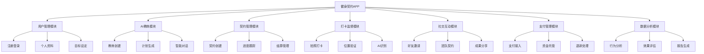
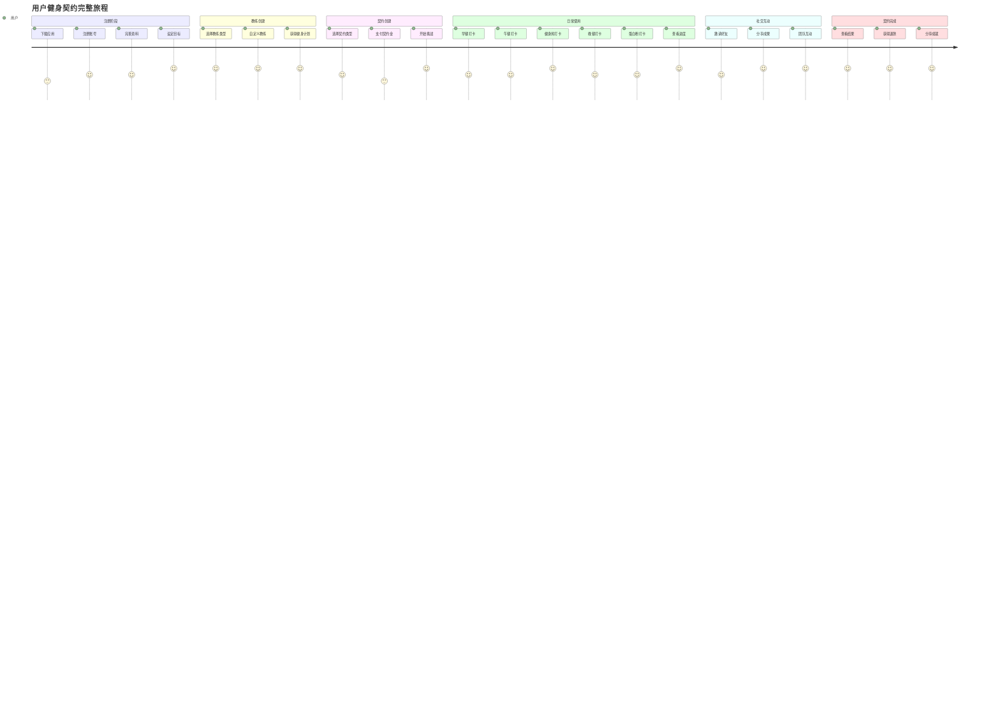
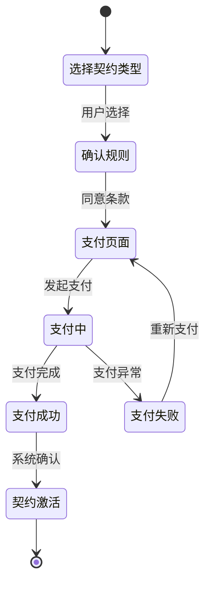
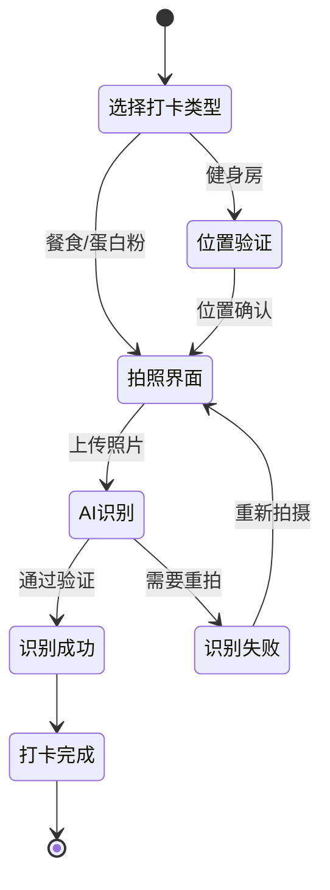
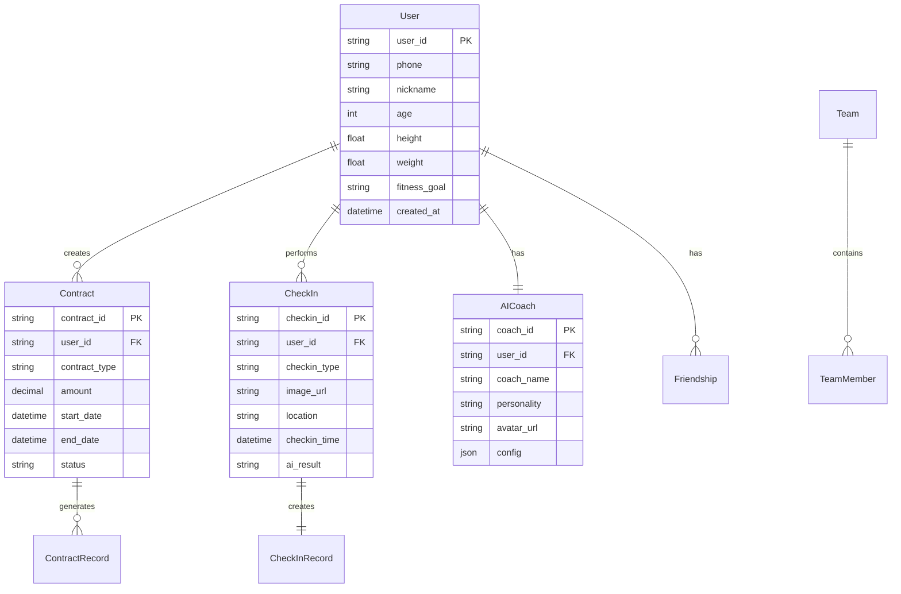

# 健身契约 - 产品需求文档 (PRD)

## 1. 文档信息

### 1.1 版本历史
| 版本 | 日期 | 修改内容 | 作者 |
|------|------|----------|------|
| v1.0 | 2024-12-19 | 初始版本创建 | 产品经理 |

### 1.2 文档目的
本文档旨在详细描述"健身契约"应用的产品需求、功能规格和技术要求，为设计、开发、测试团队提供明确的工作指导。

### 1.3 相关文档引用
- 产品路线图 (Roadmap.md)
- 用户故事地图 (User_Story_Map.md)
- 产品评估指标框架 (Metrics_Framework.md)

## 2. 产品概述

### 2.1 产品名称与定位
**产品名称**: 健身契约
**产品定位**: 面向健身小白的AI驱动健身监督与社交激励平台

### 2.2 产品愿景与使命
**愿景**: 成为最有效的健身习惯养成工具，让每个人都能坚持健康生活方式
**使命**: 通过AI教练指导、契约机制约束和社交监督激励，帮助用户建立持续的健身习惯

### 2.3 价值主张与独特卖点(USP)
- **契约机制**: 独特的金钱约束机制，提高用户坚持动力
- **AI个性化教练**: 基于DeepSeek大模型的智能教练，可自定义性格和身份
- **社交监督**: 微信好友监督功能，增强社交压力和动力
- **关卡游戏化**: 将健身任务游戏化，提升用户参与度
- **公益属性**: 违约金部分用于慈善，增加产品社会价值

### 2.4 目标平台列表
- **主要平台**: Android (优先)
- **后续平台**: iOS (基于Android版本用户反馈后开发)

### 2.5 产品核心假设
1. 金钱约束能有效提高用户健身坚持率
2. AI个性化教练能替代真人教练的部分功能
3. 社交监督比个人自律更有效
4. 18-40岁健身小白有强烈的健身指导需求

### 2.6 商业模式概述
- **契约收费**: 用户支付契约金，违约扣款，完成返还
- **高级功能**: 高级AI教练定制、专业训练计划等
- **教练定制**: 个性化AI教练形象和性格定制

## 3. 用户研究

### 3.1 目标用户画像

#### 3.1.1 人口统计特征
- **年龄**: 18-40岁
- **性别**: 男女不限，预期男性占比60%
- **收入**: 月收入3000-15000元
- **地域**: 一二三线城市为主
- **教育**: 高中及以上学历

#### 3.1.2 行为习惯与偏好
- 健身经验少或无经验
- 经济条件不允许请私人教练
- 缺乏自律性，需要外部监督
- 活跃在社交媒体，重视他人看法
- 习惯使用手机应用解决生活问题

#### 3.1.3 核心需求与痛点
**核心需求**:
- 专业的健身指导
- 有效的监督机制
- 经济实惠的解决方案
- 社交认可和成就感

**主要痛点**:
- 不知道如何正确健身
- 缺乏坚持动力
- 私教费用过高
- 健身房环境陌生
- 饮食控制困难

#### 3.1.4 动机与目标
- **减肥**: 改善体型，提升自信
- **增肌**: 增强体质，塑造身材
- **健康**: 改善生活质量
- **社交**: 获得他人认可

### 3.2 用户场景分析

#### 3.2.1 核心使用场景详述
1. **早晨起床**: 用户拍摄早餐照片打卡
2. **午餐时间**: 用户拍摄午餐照片打卡
3. **健身房**: 用户到达健身房，定位+拍照打卡
4. **晚餐后**: 用户拍摄晚餐照片打卡
5. **睡前**: 用户拍摄蛋白粉照片打卡(增肌用户)
6. **周末**: 用户查看周进度，与好友分享成果

#### 3.2.2 边缘使用场景考量
- 出差/旅行期间的打卡适配
- 生病/特殊情况的请假机制
- 网络不佳时的离线打卡
- 隐私保护需求较高的用户

## 4. 市场与竞品分析

### 4.1 市场规模与增长预测
- 中国健身市场规模约1500亿元，年增长率15%
- 健身APP用户规模约2亿，月活跃用户5000万
- 目标细分市场(健身监督类)约500万用户

### 4.2 行业趋势分析
- AI技术在健身领域应用日益成熟
- 用户对个性化健身方案需求增长
- 社交化健身成为新趋势
- 付费健身服务接受度提升

### 4.3 竞争格局分析

#### 4.3.1 直接竞争对手详析
| 产品 | 优势 | 劣势 | 定价 |
|------|------|------|------|
| Keep | 用户基数大，内容丰富 | 缺乏强制监督机制 | 免费+会员制 |
| 薄荷健康 | 饮食管理专业 | 健身指导较弱 | 免费+增值服务 |
| 咕咚 | 运动社交强 | 个性化不足 | 免费+会员制 |

#### 4.3.2 间接竞争对手概述
- 线下健身房和私教
- 其他习惯养成类APP
- 健身器材和营养品品牌

### 4.4 竞品功能对比矩阵
| 功能 | 健身契约 | Keep | 薄荷健康 | 咕咚 |
|------|----------|------|----------|------|
| AI教练 | ✅个性化 | ❌ | ❌ | ❌ |
| 契约机制 | ✅独有 | ❌ | ❌ | ❌ |
| 社交监督 | ✅微信好友 | ✅社区 | ❌ | ✅运动社交 |
| 饮食监督 | ✅拍照识别 | ❌ | ✅专业 | ❌ |
| 位置验证 | ✅健身房 | ❌ | ❌ | ✅跑步 |

### 4.5 市场差异化策略
1. **契约机制**: 市场首创的金钱约束模式
2. **AI个性化**: 深度定制的AI教练体验
3. **强制监督**: 严格的打卡验证机制
4. **公益属性**: 违约金慈善捐赠的社会价值

## 5. 产品功能需求

### 5.1 功能架构与模块划分

### 5.2 核心功能详述

#### 5.2.1 AI教练模块

**功能描述**: 
作为健身小白用户，我想要拥有一个个性化的AI教练，以便获得专业的健身指导和持续的激励支持。

**用户价值**:
- 获得个性化健身计划
- 享受24/7可用的专业指导
- 体验有趣的互动激励

**功能逻辑与规则**:
1. **教练创建流程**:
   - 用户输入基本信息(身高、体重、年龄、健身目标)
   - 系统基于DeepSeek大模型生成个性化教练
   - 用户可自定义教练姓名、性格、说话风格、头像
   
2. **计划生成逻辑**:
   - 根据用户目标(减肥/增肌)制定不同策略
   - 减肥用户: 重点饮食控制+有氧运动
   - 增肌用户: 重点力量训练+蛋白质补充
   - 动态调整: 根据用户进度和反馈优化计划

3. **智能对话机制**:
   - 每日问候和任务提醒
   - 根据打卡情况给予鼓励或督促
   - 回答用户健身相关问题
   - 个性化的激励话术

**交互要求**:
- 教练形象支持多种风格选择(严厉型、温和型、幽默型等)
- 对话界面类似聊天应用，支持语音和文字
- 教练设置页面支持实时预览效果

**数据需求**:
- 用户基础信息(身高、体重、年龄、性别)
- 健身目标和偏好设置
- 历史对话记录和用户反馈
- 教练个性化配置参数

**技术依赖**:
- DeepSeek大模型API
- 语音合成和识别服务
- 图像生成服务(教练头像)

**验收标准**:
- AI教练能根据用户信息生成合理的健身计划
- 教练个性化设置能实时生效
- 对话响应时间<3秒
- 计划准确率>85%(基于专业教练评估)

#### 5.2.2 契约管理模块

**功能描述**:
作为想要约束自己的用户，我想要创建健身契约并承担违约责任，以便通过经济压力提高自己的坚持率。

**用户价值**:
- 通过经济约束提高自律性
- 获得完成挑战的成就感
- 参与公益事业的满足感

**功能逻辑与规则**:
1. **契约类型**:
   - 普通契约: 30元/30天，违约扣3元/天
   - 勇者契约: 90元/30天，违约扣9元/天
   - 自定义契约: 用户自定义金额，违约扣款比例为10%/天

2. **违约判定规则**:
   - 每日任务: 三餐打卡+健身房打卡+蛋白粉打卡(增肌用户)
   - 违约定义: 当日23:59前未完成所有必需任务
   - 宽限机制: 从第3天开始按规则扣款，30天内可以请假3天，这三天不会扣款

3. **资金处理流程**:
   - 契约金预授权冻结
   - 违约金50%平台收入，50%慈善捐赠
   - 完成契约后剩余资金全额退还
   - 退款处理时间1-3个工作日

**交互要求**:
- 契约创建页面清晰展示规则和风险
- 进度页面实时显示完成情况和剩余金额
- 违约提醒要明显但不过于打扰

**数据需求**:
- 契约基本信息(类型、金额、开始时间)
- 每日任务完成记录
- 违约记录和扣款明细
- 资金流水和退款记录

**技术依赖**:
- 支付宝/微信支付API
- 资金托管服务
- 定时任务调度系统

**验收标准**:
- 契约创建成功率>99%
- 违约判定准确率100%
- 资金处理无差错
- 退款及时率>95%

#### 5.2.3 打卡监督模块

**功能描述**:
作为需要监督的用户，我想要通过拍照和定位验证完成健身任务，以便证明我确实执行了健身计划。

**用户价值**:
- 获得任务完成的确认和成就感
- 通过严格验证避免自欺欺人
- 建立真实的健身记录

**功能逻辑与规则**:
1. **拍照打卡规则**:
   - 只能实时拍摄，禁止从相册选择
   - 照片必须包含时间戳和地理位置信息
   - 减肥用户: AI识别食物健康度，不健康食物需要客服审核
   - 增肌用户: 蛋白粉识别，确认为蛋白质补充产品

2. **位置验证规则**:
   - 健身房打卡需要GPS定位+拍照双重验证
   - 系统维护健身房位置数据库
   - 允许用户添加新健身房位置(需审核)
   - 定位精度要求在50米范围内

3. **AI识别逻辑**:
   - 食物识别: 判断健康度评分(0-100分)
   - 蛋白粉识别: 识别产品类型和品牌，只要是蛋白粉就可以
   - 健身房环境识别: 确认为健身场所
   - 识别准确率要求>90%

**交互要求**:
- 拍照界面简洁，一键拍摄上传
- 实时显示识别结果和健康度评分
- 位置服务权限申请要说明用途

**数据需求**:
- 照片文件和元数据信息
- GPS坐标和时间戳
- AI识别结果和置信度
- 健身房位置数据库

**技术依赖**:
- 图像识别AI服务
- GPS定位服务
- 地图服务API
- 云存储服务

**验收标准**:
- 拍照上传成功率>98%
- AI识别准确率>90%
- 位置验证准确率>95%
- 打卡响应时间<5秒

#### 5.2.4 社交互动模块

**功能描述**:
作为希望获得社交支持的用户，我想要邀请微信好友监督我的健身进度，以便获得额外的动力和支持。

**用户价值**:
- 获得朋友的监督和鼓励
- 增强社交互动和话题
- 提高坚持的社会压力

**功能逻辑与规则**:
1. **好友邀请机制**:
   - 通过微信分享邀请好友关注
   - 好友可查看用户的打卡进度(需用户授权)
   - 好友可发送鼓励消息和表情
   - 用户可设置监督权限级别

2. **团队契约功能**:
   - 多人组队创建团队契约
   - 团队成员互相监督
   - 团队完成率影响个人奖励
   - 团队排行榜和成就系统

3. **成果分享机制**:
   - 自动生成健身成果海报
   - 支持分享到微信朋友圈
   - 展示前后对比照片(可选)
   - 分享数据包括天数、体重变化等

**交互要求**:
- 微信授权流程要简单明了
- 好友列表界面清晰易用
- 分享海报设计要美观吸引人

**数据需求**:
- 微信好友关系数据
- 用户授权和隐私设置
- 团队成员信息和进度
- 分享内容和统计数据

**技术依赖**:
- 微信开放平台API
- 图片处理和海报生成服务
- 推送通知服务

**验收标准**:
- 微信授权成功率>95%
- 好友邀请到达率>90%
- 分享功能正常使用率>80%
- 团队功能参与率>30%

### 5.3 次要功能描述

#### 5.3.1 数据统计分析
- 个人健身数据报告
- 体重/体脂变化趋势图
- 习惯养成分析
- 同类用户对比

#### 5.3.2 客服申诉系统
- AI识别争议申诉
- 特殊情况请假申请
- 技术问题反馈
- 人工客服支持

#### 5.3.3 积分奖励系统
- 连续打卡积分奖励
- 完成契约额外积分
- 积分兑换优惠券
- 会员等级体系

### 5.4 未来功能储备 (Backlog)

#### 5.4.1 高级功能扩展
- 专业营养师咨询服务
- 个性化补剂推荐
- 高级训练计划定制
- VIP专属AI教练形象

#### 5.4.2 硬件集成
- 智能手环/手表数据同步
- 体脂秤数据接入
- 智能健身器材连接

#### 5.4.3 内容生态
- 健身知识库
- 用户原创内容分享
- 专家直播课程
- 健身挑战活动

## 6. 用户流程与交互设计指导

### 6.1 核心用户旅程地图

### 6.2 关键流程详述与状态转换图

#### 6.2.1 契约创建流程

#### 6.2.2 日常打卡流程

### 6.3 对设计师 (UI/UX Agent) 的界面原型参考说明和要求

#### 6.3.1 整体设计风格
- **色彩方案**: 以活力橙色为主色调，搭配深蓝色和白色
- **设计语言**: 现代简约风格，圆角设计，渐变效果
- **字体**: 使用系统默认字体，确保可读性
- **图标**: 线性图标风格，保持一致性

#### 6.3.2 关键页面设计要求

**首页设计**:
- 顶部显示AI教练头像和问候语
- 中间展示今日任务进度环形图
- 底部显示快速打卡按钮组
- 强调当前契约状态和剩余天数

**打卡页面设计**:
- 大尺寸拍照按钮，易于单手操作
- 实时显示拍照预览
- AI识别结果要有明确的成功/失败状态
- 提供重拍和确认按钮

**契约页面设计**:
- 清晰展示三种契约类型的对比
- 使用卡片式布局突出差异
- 风险提示要醒目但不恐吓
- 支付按钮要有安全感

#### 6.3.3 交互设计规范
- 所有按钮要有点击反馈动画
- 加载状态要有明确的进度指示
- 错误提示要友好且具有指导性
- 成功操作要有庆祝动画效果

### 6.4 交互设计原则建议
1. **简单易用**: 核心操作不超过3步
2. **即时反馈**: 所有操作都要有即时响应
3. **容错设计**: 允许用户犯错并提供恢复机制
4. **情感化设计**: 通过动画和文案传递正能量

## 7. 非功能需求

### 7.1 性能需求

#### 7.1.1 响应时间要求
- 应用启动时间: <3秒
- 页面切换时间: <1秒
- 拍照上传时间: <5秒
- AI识别响应时间: <3秒
- 支付处理时间: <10秒

#### 7.1.2 并发量要求
- 支持同时在线用户: 10,000人
- 峰值并发请求: 1,000 QPS
- 图片上传并发: 500个/分钟
- 支付并发处理: 100笔/分钟

#### 7.1.3 稳定性要求
- 系统可用性: 99.9%
- 崩溃率: <0.1%
- ANR率: <0.05%
- 内存使用: <200MB

#### 7.1.4 资源使用率
- CPU使用率: <30%
- 电池消耗: 低于同类应用平均水平
- 流量消耗: 每日<50MB
- 存储空间: <500MB

### 7.2 安全需求

#### 7.2.1 数据加密
- 传输加密: 全站HTTPS/TLS 1.3
- 存储加密: 敏感数据AES-256加密
- 支付数据: 符合PCI DSS标准
- 用户密码: BCrypt哈希存储

#### 7.2.2 认证授权
- 多因素认证: 支持短信验证码
- 会话管理: JWT Token机制
- 权限控制: RBAC角色权限模型
- API安全: OAuth 2.0授权

#### 7.2.3 隐私保护
- 数据最小化: 只收集必要数据
- 用户同意: 明确的隐私政策
- 数据删除: 支持用户数据删除
- 匿名化: 统计数据去标识化

#### 7.2.4 防攻击策略
- DDoS防护: CDN和防火墙
- SQL注入防护: 参数化查询
- XSS防护: 输入验证和输出编码
- 接口限流: 防止恶意调用

### 7.3 可用性与可访问性标准

#### 7.3.1 易用性要求
- 学习成本: 新用户5分钟内掌握核心功能
- 操作效率: 日常打卡操作<30秒完成
- 错误率: 用户操作错误率<5%
- 满意度: 用户满意度>4.0/5.0

#### 7.3.2 可访问性标准
- 支持TalkBack等无障碍服务
- 字体大小可调节
- 高对比度模式支持
- 语音操作支持(未来版本)

### 7.4 合规性要求

#### 7.4.1 法律法规
- 《网络安全法》合规
- 《个人信息保护法》合规
- 《数据安全法》合规
- 支付相关法规合规

#### 7.4.2 行业标准
- 移动应用安全标准
- 金融支付安全标准
- 健康数据处理标准
- 广告法合规要求

### 7.5 数据统计与分析需求

#### 7.5.1 用户行为埋点
- 应用启动和退出
- 页面访问和停留时间
- 功能使用频率
- 用户操作路径

#### 7.5.2 业务指标埋点
- 契约创建和完成率
- 打卡成功率和失败原因
- AI识别准确率
- 支付成功率

#### 7.5.3 性能监控埋点
- 应用性能指标
- 接口响应时间
- 错误日志和崩溃报告
- 资源使用情况

## 8. 技术架构考量

### 8.1 技术栈建议

#### 8.1.1 移动端技术栈
- **开发框架**: Android Native (Kotlin)
- **UI框架**: Material Design 3
- **网络库**: Retrofit + OkHttp
- **图片处理**: Glide
- **数据库**: Room + SQLite
- **依赖注入**: Hilt

#### 8.1.2 后端技术栈
- **开发语言**: Java/Kotlin (Spring Boot)
- **数据库**: MySQL + Redis
- **消息队列**: RabbitMQ
- **文件存储**: 阿里云OSS
- **容器化**: Docker + Kubernetes

#### 8.1.3 AI服务技术栈
- **大模型**: DeepSeek API
- **图像识别**: 百度AI/腾讯AI
- **语音服务**: 科大讯飞
- **推荐算法**: 自研算法引擎

### 8.2 系统集成需求

#### 8.2.1 第三方服务集成
- **支付服务**: 支付宝SDK + 微信支付SDK
- **地图服务**: 高德地图API
- **推送服务**: 极光推送
- **统计分析**: 友盟统计

#### 8.2.2 微信生态集成
- **微信登录**: 微信开放平台
- **好友关系**: 微信API
- **分享功能**: 微信分享SDK
- **小程序**: 未来扩展考虑

### 8.3 技术依赖与约束

#### 8.3.1 性能约束
- 图片上传大小限制: 10MB
- 视频上传限制: 暂不支持
- 并发用户限制: 基于服务器配置
- API调用频率限制: 防止滥用

#### 8.3.2 兼容性约束
- Android版本: 支持Android 7.0+
- 设备要求: 2GB RAM以上
- 网络要求: 3G/4G/5G/WiFi
- 存储要求: 至少500MB可用空间

### 8.4 数据模型建议

#### 8.4.1 核心实体关系

## 9. 验收标准汇总

### 9.1 功能验收标准矩阵

| 功能模块 | 验收标准 | 测试方法 | 成功标准 |
|----------|----------|----------|----------|
| AI教练 | 计划生成准确率>85% | 专业教练评估 | 通过评估 |
| 契约管理 | 违约判定准确率100% | 自动化测试 | 无误判 |
| 打卡监督 | AI识别准确率>90% | 样本测试 | 达到标准 |
| 社交互动 | 微信授权成功率>95% | 用户测试 | 达到标准 |
| 支付功能 | 支付成功率>99% | 压力测试 | 达到标准 |

### 9.2 性能验收标准

| 性能指标 | 目标值 | 测试工具 | 验收标准 |
|----------|--------|----------|----------|
| 应用启动时间 | <3秒 | 自动化测试 | 95%情况下达标 |
| 接口响应时间 | <1秒 | 压力测试 | 平均响应时间 |
| 并发处理能力 | 1000 QPS | 负载测试 | 稳定处理 |
| 系统可用性 | 99.9% | 监控系统 | 月度统计 |

### 9.3 质量验收标准

| 质量指标 | 目标值 | 测试方法 | 验收标准 |
|----------|--------|----------|----------|
| 代码覆盖率 | >80% | 单元测试 | 自动化检查 |
| Bug密度 | <2个/KLOC | 代码审查 | 静态分析 |
| 崩溃率 | <0.1% | 用户反馈 | 线上监控 |
| 用户满意度 | >4.0/5.0 | 用户调研 | 定期调查 |

## 10. 产品成功指标

### 10.1 关键绩效指标 (KPIs) 定义与目标

#### 10.1.1 用户增长指标
- **新用户注册数**: 月增长率>20%
- **用户留存率**: 
  - 次日留存>60%
  - 7日留存>30%
  - 30日留存>15%
- **用户活跃度**: 月活跃用户(MAU)增长率>15%

#### 10.1.2 业务核心指标
- **契约完成率**: >70%
- **平均契约金额**: >50元
- **用户付费率**: >25%
- **用户生命周期价值(LTV)**: >200元

#### 10.1.3 产品使用指标
- **日均打卡次数**: >3次/用户
- **AI教练交互频率**: >2次/天
- **社交功能使用率**: >40%
- **客服申诉率**: <5%

### 10.2 北极星指标定义与选择依据

**北极星指标**: 用户30天契约完成率

**选择依据**:
1. **直接反映产品价值**: 完成契约说明产品真正帮助用户建立了健身习惯
2. **平衡用户和商业价值**: 高完成率既代表用户成功，也意味着良好的口碑和复购
3. **可操作性强**: 可以通过优化各个功能模块来提升这个指标
4. **长期导向**: 关注用户真正的行为改变，而非短期指标

### 10.3 指标监测计划

#### 10.3.1 数据收集方式
- **实时监控**: 关键业务指标实时更新
- **日报**: 每日核心指标汇总
- **周报**: 趋势分析和异常预警
- **月报**: 全面的产品健康度评估

#### 10.3.2 报告频率
- **实时大屏**: 核心指标实时展示
- **日报邮件**: 发送给产品团队
- **周会汇报**: 产品例会讨论
- **月度复盘**: 全面的数据分析会议

#### 10.3.3 预警机制
- **指标异常**: 关键指标偏离正常范围时自动预警
- **用户反馈**: 负面反馈集中时及时响应
- **技术异常**: 系统故障或性能问题实时通知
- **竞品动态**: 竞争对手重大更新时关注影响

---

**文档版本**: v1.0  
**最后更新**: 2024-12-19  
**下次评审**: 2024-12-26