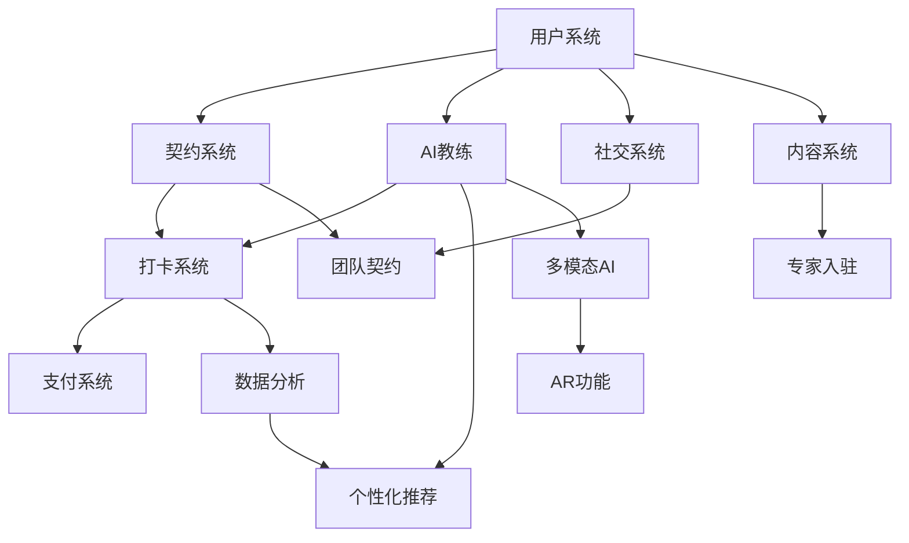
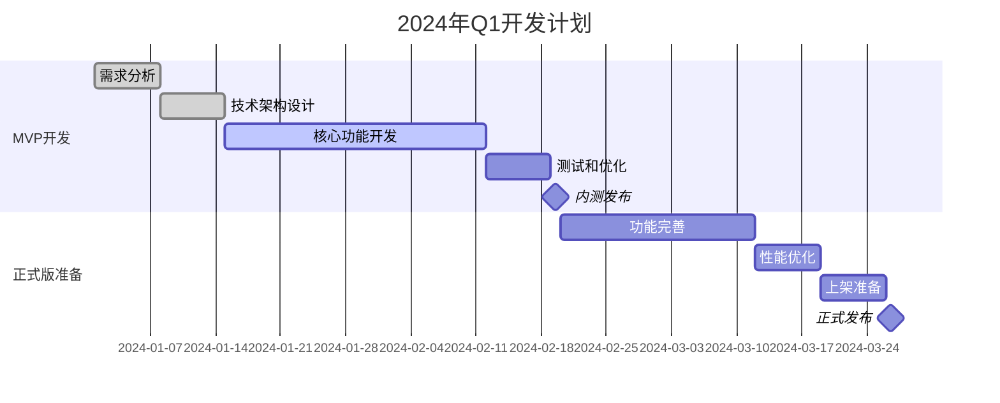
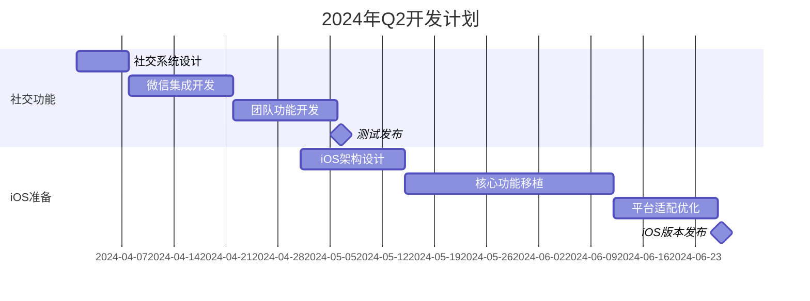
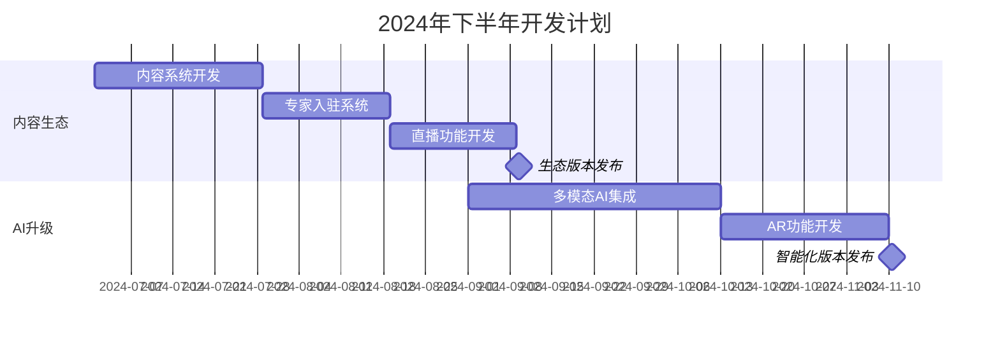
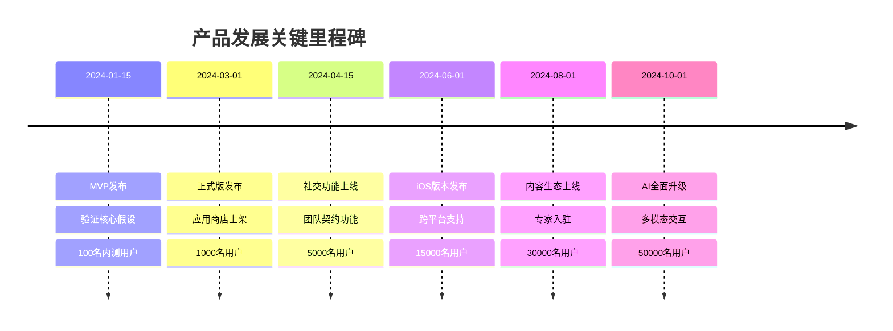

# 健身契约 - 产品路线图 (Roadmap)

## 1. 路线图概述

### 1.1 产品发展愿景
健身契约将分阶段发展，从MVP验证核心假设开始，逐步扩展功能生态，最终成为领先的AI驱动健身习惯养成平台。

### 1.2 发展策略
- **第一阶段**: 验证核心价值假设，建立用户基础
- **第二阶段**: 完善功能体验，扩大用户规模
- **第三阶段**: 构建生态平台，实现商业化突破

### 1.3 平台扩展计划
- **Phase 1**: Android平台(主要)
- **Phase 2**: iOS平台扩展
- **Phase 3**: 微信小程序版本
- **Phase 4**: Web端管理后台

## 2. 版本规划策略

### 2.1 版本命名规则
- **MVP**: v0.9.x (内测版本)
- **正式版**: v1.x.x (公开发布)
- **功能版**: v2.x.x (重大功能更新)
- **平台版**: v3.x.x (多平台支持)

### 2.2 发布周期
- **MVP阶段**: 2周一个迭代
- **正式版阶段**: 4周一个大版本
- **成熟期**: 6-8周一个大版本
- **紧急修复**: 随时发布补丁版本

### 2.3 用户反馈收集机制
- **内测用户群**: 50-100人深度体验
- **Beta测试**: 500-1000人规模测试
- **灰度发布**: 10%-50%-100%逐步放量
- **用户调研**: 定期问卷和访谈

## 3. 详细版本规划

### 3.1 MVP版本 (v0.9.0) - 核心验证阶段

**发布时间**: 2024年1月15日  
**开发周期**: 8周  
**目标用户**: 100名内测用户

#### 3.1.1 核心功能
**P0 (必须有)**:
- ✅ 用户注册登录系统
- ✅ 基础AI教练创建和对话
- ✅ 简化版契约系统(仅30元懦夫契约)
- ✅ 基础打卡功能(拍照+简单验证)
- ✅ 支付宝支付集成
- ✅ 基础数据统计

**P1 (应该有)**:
- ✅ AI食物识别(基础版)
- ✅ 健身房位置验证
- ✅ 简单的进度展示
- ✅ 基础客服系统

**P2 (可以有)**:
- ❌ 微信好友功能(延后)
- ❌ 复杂的AI教练定制(延后)
- ❌ 高级统计分析(延后)

#### 3.1.2 技术架构
- **前端**: Android Native (Kotlin)
- **后端**: Spring Boot + MySQL
- **AI服务**: DeepSeek API (基础调用)
- **支付**: 支付宝SDK
- **部署**: 单机部署，基础监控

#### 3.1.3 验收标准
- 用户注册成功率 > 95%
- 契约创建成功率 > 90%
- 打卡功能正常使用率 > 85%
- 应用崩溃率 < 1%
- 用户反馈满意度 > 3.5/5.0

#### 3.1.4 风险与应对
- **风险**: AI识别准确率不足
- **应对**: 准备人工审核备选方案
- **风险**: 支付集成问题
- **应对**: 提前完成支付测试环境搭建

### 3.2 正式版本 (v1.0.0) - 公开发布阶段

**发布时间**: 2024年3月1日  
**开发周期**: 6周  
**目标用户**: 1000名用户

#### 3.2.1 新增功能
**P0 (必须有)**:
- ✅ 完整契约系统(30元/90元/自定义)
- ✅ 微信支付集成
- ✅ 改进的AI教练个性化设置
- ✅ 完善的打卡验证机制
- ✅ 用户申诉和客服系统

**P1 (应该有)**:
- ✅ 基础社交功能(好友邀请)
- ✅ 成果分享功能
- ✅ 改进的AI食物识别
- ✅ 用户数据统计面板

**P2 (可以有)**:
- ✅ 简单的积分奖励系统
- ✅ 基础的用户等级体系
- ❌ 团队契约功能(延后到v1.1)

#### 3.2.2 技术优化
- 性能优化: 启动时间 < 3秒
- 稳定性提升: 崩溃率 < 0.1%
- 服务器扩容: 支持1000并发用户
- 监控完善: 全面的业务指标监控

#### 3.2.3 运营准备
- 应用商店上架准备
- 用户增长策略制定
- 客服团队建设
- 市场推广素材准备

### 3.3 功能增强版本 (v1.1.0) - 社交强化阶段

**发布时间**: 2024年4月15日  
**开发周期**: 6周  
**目标用户**: 5000名用户

#### 3.3.1 核心更新
**P0 (必须有)**:
- ✅ 团队契约功能
- ✅ 微信好友监督系统
- ✅ 改进的AI教练对话能力
- ✅ 完善的争议处理机制

**P1 (应该有)**:
- ✅ 健身数据分析报告
- ✅ 个性化推荐系统
- ✅ 用户成长体系
- ✅ 社区互动功能

#### 3.3.2 商业化探索
- 高级AI教练定制服务
- 专业营养师咨询
- 品牌合作和广告位
- 会员增值服务

### 3.4 平台扩展版本 (v2.0.0) - iOS平台支持

**发布时间**: 2024年6月1日  
**开发周期**: 8周  
**目标用户**: 15000名用户

#### 3.4.1 平台功能
**P0 (必须有)**:
- ✅ iOS原生应用开发
- ✅ 跨平台数据同步
- ✅ iOS特有功能适配
- ✅ Apple Pay支付集成

**P1 (应该有)**:
- ✅ HealthKit数据集成
- ✅ Apple Watch支持
- ✅ Siri快捷指令
- ✅ iOS推送通知优化

#### 3.4.2 技术架构升级
- 微服务架构改造
- 数据库分库分表
- CDN和缓存优化
- 多平台CI/CD流水线

### 3.5 生态平台版本 (v2.1.0) - 内容生态建设

**发布时间**: 2024年8月1日  
**开发周期**: 8周  
**目标用户**: 30000名用户

#### 3.5.1 生态功能
**P0 (必须有)**:
- ✅ 健身知识库
- ✅ 用户原创内容分享
- ✅ 专家入驻系统
- ✅ 直播课程功能

**P1 (应该有)**:
- ✅ 智能推荐算法
- ✅ 内容审核系统
- ✅ 创作者激励计划
- ✅ 品牌合作平台

### 3.6 智能化升级版本 (v3.0.0) - AI能力全面提升

**发布时间**: 2024年10月1日  
**开发周期**: 10周  
**目标用户**: 50000名用户

#### 3.6.1 AI功能升级
**P0 (必须有)**:
- ✅ 多模态AI教练(语音+视觉)
- ✅ 智能训练计划动态调整
- ✅ 高精度身体数据分析
- ✅ 个性化营养建议系统

**P1 (应该有)**:
- ✅ AR健身指导
- ✅ 智能硬件集成
- ✅ 预测性健康分析
- ✅ 情感化AI交互

## 4. 功能优先级矩阵

### 4.1 功能优先级分类

#### 4.1.1 P0级功能 (核心功能)
| 功能 | 版本 | 重要性 | 紧急性 | 开发难度 |
|------|------|--------|--------|----------|
| 用户注册登录 | MVP | 高 | 高 | 低 |
| 契约管理系统 | MVP | 高 | 高 | 中 |
| 基础打卡功能 | MVP | 高 | 高 | 中 |
| 支付系统集成 | MVP | 高 | 高 | 高 |
| AI教练基础功能 | MVP | 高 | 高 | 高 |

#### 4.1.2 P1级功能 (重要功能)
| 功能 | 版本 | 重要性 | 紧急性 | 开发难度 |
|------|------|--------|--------|----------|
| 社交监督功能 | v1.1 | 高 | 中 | 中 |
| AI识别优化 | v1.0 | 中 | 高 | 高 |
| 数据分析报告 | v1.1 | 中 | 中 | 中 |
| iOS平台支持 | v2.0 | 高 | 低 | 高 |
| 内容生态系统 | v2.1 | 中 | 低 | 高 |

#### 4.1.3 P2级功能 (增值功能)
| 功能 | 版本 | 重要性 | 紧急性 | 开发难度 |
|------|------|--------|--------|----------|
| 积分奖励系统 | v1.0 | 低 | 低 | 低 |
| 硬件设备集成 | v3.0 | 中 | 低 | 高 |
| AR健身指导 | v3.0 | 低 | 低 | 高 |
| 小程序版本 | 未定 | 低 | 低 | 中 |

### 4.2 功能依赖关系图

## 5. 详细时间线计划

### 5.1 2024年Q1 - 产品验证期

### 5.2 2024年Q2 - 功能完善期

### 5.3 2024年Q3-Q4 - 生态建设期

## 6. 资源规划

### 6.1 团队配置建议

#### 6.1.1 MVP阶段团队 (8人)
- **产品经理**: 1人 (负责需求和协调)
- **Android开发**: 2人 (前端开发)
- **后端开发**: 2人 (API和服务)
- **AI工程师**: 1人 (AI集成和优化)
- **测试工程师**: 1人 (质量保证)
- **UI/UX设计师**: 1人 (界面设计)

#### 6.1.2 正式版阶段团队 (12人)
- **产品经理**: 1人
- **Android开发**: 3人
- **后端开发**: 3人
- **AI工程师**: 2人
- **测试工程师**: 2人
- **UI/UX设计师**: 1人

#### 6.1.3 平台扩展阶段团队 (18人)
- **产品经理**: 2人 (Android + iOS)
- **Android开发**: 3人
- **iOS开发**: 3人
- **后端开发**: 4人
- **AI工程师**: 2人
- **测试工程师**: 3人
- **UI/UX设计师**: 1人

### 6.2 技术资源规划

#### 6.2.1 服务器资源
- **MVP阶段**: 2核4G云服务器 × 2台
- **正式版阶段**: 4核8G云服务器 × 4台
- **扩展阶段**: 8核16G云服务器 × 8台 + CDN

#### 6.2.2 第三方服务成本
- **AI服务**: DeepSeek API调用费用
- **云存储**: 图片和数据存储费用
- **支付服务**: 支付宝/微信手续费
- **推送服务**: 消息推送服务费用

### 6.3 预算规划

#### 6.3.1 开发成本预算
| 阶段 | 人力成本 | 技术成本 | 运营成本 | 总计 |
|------|----------|----------|----------|------|
| MVP | 80万 | 10万 | 5万 | 95万 |
| 正式版 | 120万 | 20万 | 15万 | 155万 |
| 扩展期 | 200万 | 40万 | 30万 | 270万 |

#### 6.3.2 运营成本预算
- **服务器费用**: 月均2-10万
- **第三方服务**: 月均1-5万
- **推广费用**: 月均10-50万
- **客服成本**: 月均2-8万

## 7. 风险管理

### 7.1 技术风险

#### 7.1.1 AI识别准确率风险
**风险描述**: AI食物识别准确率不达标，影响用户体验
**影响程度**: 高
**发生概率**: 中
**应对策略**:
- 准备多个AI服务商备选方案
- 建立人工审核机制
- 持续优化训练数据集
- 设置用户反馈改进机制

#### 7.1.2 支付系统风险
**风险描述**: 支付集成出现问题，影响资金安全
**影响程度**: 高
**发生概率**: 低
**应对策略**:
- 选择成熟的支付服务商
- 建立完善的测试环境
- 实施严格的资金监控
- 准备应急处理预案

#### 7.1.3 性能扩展风险
**风险描述**: 用户增长超预期，系统性能不足
**影响程度**: 中
**发生概率**: 中
**应对策略**:
- 设计可扩展的架构
- 实施性能监控和预警
- 准备快速扩容方案
- 建立降级和限流机制

### 7.2 市场风险

#### 7.2.1 竞品冲击风险
**风险描述**: 大厂推出类似产品，抢占市场份额
**影响程度**: 高
**发生概率**: 中
**应对策略**:
- 建立技术和功能壁垒
- 快速迭代保持领先
- 深耕细分用户群体
- 建立用户忠诚度

#### 7.2.2 用户接受度风险
**风险描述**: 契约机制用户接受度不高
**影响程度**: 高
**发生概率**: 中
**应对策略**:
- 充分的用户调研和测试
- 灵活的契约规则设计
- 强化用户教育和引导
- 准备替代方案

### 7.3 法规风险

#### 7.3.1 金融监管风险
**风险描述**: 契约机制涉及资金托管，可能面临监管问题
**影响程度**: 高
**发生概率**: 低
**应对策略**:
- 咨询专业法律意见
- 与监管部门提前沟通
- 设计合规的业务模式
- 准备业务调整方案

#### 7.3.2 数据隐私风险
**风险描述**: 用户数据处理不当，违反隐私法规
**影响程度**: 中
**发生概率**: 低
**应对策略**:
- 严格遵守数据保护法规
- 实施数据最小化原则
- 建立完善的隐私政策
- 定期进行合规审查

### 7.4 风险监控机制

#### 7.4.1 技术监控
- 实时性能监控和告警
- 错误日志分析和处理
- 用户反馈收集和分析
- 定期安全审计

#### 7.4.2 业务监控
- 关键指标实时跟踪
- 用户行为异常检测
- 竞品动态监控
- 市场趋势分析

#### 7.4.3 应急响应
- 建立应急响应团队
- 制定详细应急预案
- 定期演练和优化
- 建立外部支持网络

## 8. 成功标准与里程碑

### 8.1 版本成功标准

#### 8.1.1 MVP成功标准
- 完成核心功能开发和测试
- 内测用户满意度 > 3.5/5.0
- 契约完成率 > 60%
- 系统稳定性 > 95%
- 获得100个真实用户反馈

#### 8.1.2 正式版成功标准
- 应用商店成功上架
- 获得1000个注册用户
- 用户留存率: 次日>50%, 7日>25%
- 契约完成率 > 65%
- 用户满意度 > 4.0/5.0

#### 8.1.3 扩展版成功标准
- iOS版本成功发布
- 总用户数达到10000
- 月活跃用户 > 3000
- 付费用户比例 > 20%
- 实现收支平衡

### 8.2 关键里程碑

### 8.3 退出条件

#### 8.3.1 项目终止条件
- MVP阶段用户反馈极差(满意度<2.0)
- 契约完成率持续低于40%
- 技术实现成本超预算100%
- 面临无法解决的法规风险

#### 8.3.2 方向调整条件
- 用户增长停滞超过3个月
- 竞品推出明显优势功能
- 市场环境发生重大变化
- 核心假设被证伪

---

**文档版本**: v1.0  
**最后更新**: 2024-12-19  
**下次评审**: 2024-12-26  
**负责人**: 产品团队