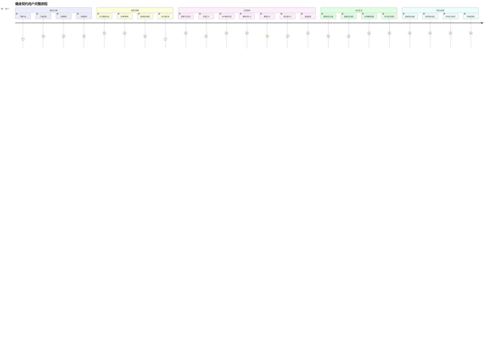
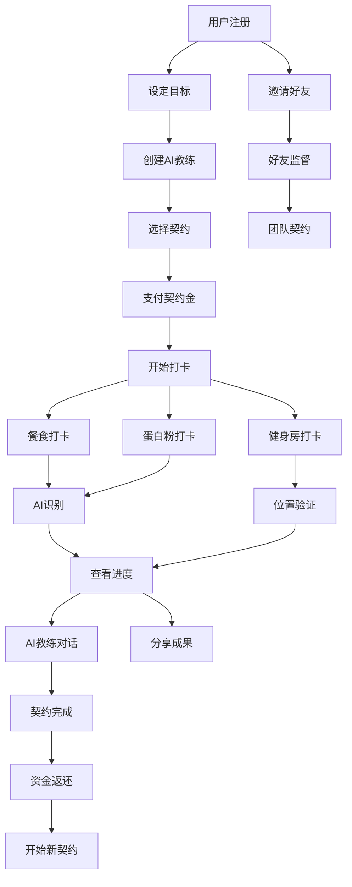

# 健身契约 - 用户故事地图 (User Story Map)

## 1. 用户故事地图概述

### 1.1 用户故事地图目的
用户故事地图帮助团队从用户视角理解产品功能，确保开发的功能真正满足用户需求，并为产品迭代提供清晰的优先级指导。

### 1.2 主要用户角色
- **健身小白**: 18-40岁，缺乏健身经验，需要指导和监督
- **自律困难者**: 有健身意愿但缺乏坚持能力的用户
- **社交驱动者**: 希望通过社交压力和支持来维持健身习惯的用户
- **目标导向者**: 有明确健身目标(减肥/增肌)的用户

### 1.3 用户旅程阶段
1. **发现阶段**: 了解产品，产生兴趣
2. **注册阶段**: 创建账户，设置目标
3. **设置阶段**: 配置AI教练，创建契约
4. **使用阶段**: 日常打卡，与AI教练互动
5. **社交阶段**: 邀请好友，分享成果
6. **完成阶段**: 契约结束，获得成就

## 2. 用户活动流 (横向)

### 2.1 用户活动流程图

### 2.2 核心用户活动详述

#### 2.2.1 发现与注册活动
**活动目标**: 让用户了解产品价值并成功注册

**关键触点**:
- 应用商店产品页面
- 朋友推荐和分享
- 社交媒体广告
- 应用内引导流程

**用户期望**:
- 快速了解产品核心价值
- 简单快捷的注册流程
- 清晰的隐私政策说明
- 吸引人的产品介绍

#### 2.2.2 设置与配置活动
**活动目标**: 帮助用户完成个性化设置，开始健身旅程

**关键触点**:
- 目标设定向导
- AI教练创建界面
- 契约选择页面
- 支付确认流程

**用户期望**:
- 个性化的设置体验
- 清晰的契约规则说明
- 安全可靠的支付流程
- 有趣的AI教练定制

#### 2.2.3 日常使用活动
**活动目标**: 让用户养成日常打卡习惯，与AI教练建立连接

**关键触点**:
- 每日任务界面
- 拍照打卡功能
- AI教练对话界面
- 进度展示页面

**用户期望**:
- 简单快捷的打卡流程
- 准确的AI识别结果
- 有趣的AI教练互动
- 清晰的进度反馈

#### 2.2.4 社交互动活动
**活动目标**: 通过社交功能增强用户粘性和动力

**关键触点**:
- 好友邀请功能
- 成果分享界面
- 团队契约页面
- 社交动态展示

**用户期望**:
- 便捷的好友邀请方式
- 美观的分享内容
- 有趣的团队互动
- 适度的社交压力

#### 2.2.5 完成与成就活动
**活动目标**: 让用户获得成就感，鼓励继续使用

**关键触点**:
- 契约完成页面
- 成就展示界面
- 资金返还通知
- 新契约创建入口

**用户期望**:
- 明确的成就反馈
- 及时的资金返还
- 值得分享的成果
- 继续挑战的动力

## 3. 用户任务分解 (纵向)

### 3.1 发现与注册任务分解

#### 3.1.1 了解产品
**Epic**: 作为潜在用户，我想要了解健身契约的核心价值，以便决定是否使用

**用户故事**:
- 作为健身小白，我想要看到产品的核心功能介绍，以便了解它如何帮助我
- 作为自律困难者，我想要了解契约机制的原理，以便评估是否适合我
- 作为社交驱动者，我想要看到社交功能的展示，以便了解如何与朋友互动

**验收标准**:
- 产品介绍页面加载时间 < 2秒
- 核心功能说明清晰易懂
- 用户价值主张突出显示
- 提供试用或演示功能

#### 3.1.2 下载应用
**Epic**: 作为感兴趣的用户，我想要快速下载应用，以便开始体验

**用户故事**:
- 作为Android用户，我想要从应用商店下载应用，以便安装使用
- 作为谨慎用户，我想要查看应用权限说明，以便了解隐私保护
- 作为网络受限用户，我想要应用包体积较小，以便快速下载

**验收标准**:
- 应用包大小 < 50MB
- 权限申请说明清晰
- 支持断点续传下载
- 兼容Android 7.0+

#### 3.1.3 注册账号
**Epic**: 作为新用户，我想要快速注册账号，以便开始使用应用

**用户故事**:
- 作为手机用户，我想要用手机号快速注册，以便减少输入
- 作为微信用户，我想要用微信一键登录，以便省去注册步骤
- 作为隐私关注者，我想要了解数据使用政策，以便放心注册

**验收标准**:
- 注册流程 ≤ 3步
- 支持手机号+验证码注册
- 支持微信授权登录
- 隐私政策链接可访问

#### 3.1.4 完善资料
**Epic**: 作为新注册用户，我想要完善个人资料，以便获得个性化服务

**用户故事**:
- 作为健身新手，我想要输入身高体重等基础信息，以便获得合适的建议
- 作为目标明确者，我想要设定健身目标，以便获得针对性指导
- 作为个性化需求者，我想要选择偏好设置，以便获得定制化体验

**验收标准**:
- 必填信息不超过5项
- 支持快速选择常用选项
- 提供信息用途说明
- 允许后续修改资料

### 3.2 设置与配置任务分解

#### 3.2.1 设定健身目标
**Epic**: 作为用户，我想要设定明确的健身目标，以便获得针对性的指导

**用户故事**:
- 作为减肥需求者，我想要设定减肥目标，以便获得饮食控制指导
- 作为增肌需求者，我想要设定增肌目标，以便获得力量训练计划
- 作为健康维护者，我想要设定健康目标，以便获得均衡的建议

**验收标准**:
- 提供预设目标模板
- 支持自定义目标设定
- 目标可量化和可追踪
- 提供目标达成时间预估

#### 3.2.2 创建AI教练
**Epic**: 作为用户，我想要创建个性化的AI教练，以便获得有趣的互动体验

**用户故事**:
- 作为个性化需求者，我想要自定义教练姓名，以便建立亲密感
- 作为风格偏好者，我想要选择教练性格，以便获得合适的交流方式
- 作为视觉敏感者，我想要选择教练头像，以便获得喜欢的形象

**验收标准**:
- 提供多种性格类型选择
- 支持教练姓名自定义
- 提供丰富的头像选项
- 实时预览教练效果

#### 3.2.3 选择契约类型
**Epic**: 作为用户，我想要选择合适的契约类型，以便获得适当的约束力

**用户故事**:
- 作为谨慎用户，我想要选择30元懦夫契约，以便降低风险
- 作为自信用户，我想要选择90元勇者契约，以便增强动力
- 作为个性化用户，我想要自定义契约金额，以便匹配我的承受能力

**验收标准**:
- 清晰展示三种契约类型
- 详细说明契约规则
- 提供风险提示
- 支持契约类型对比

#### 3.2.4 支付契约金
**Epic**: 作为用户，我想要安全地支付契约金，以便开始挑战

**用户故事**:
- 作为支付宝用户，我想要用支付宝支付，以便使用熟悉的方式
- 作为微信用户，我想要用微信支付，以便快速完成支付
- 作为安全关注者，我想要了解资金安全保障，以便放心支付

**验收标准**:
- 支持支付宝和微信支付
- 支付流程安全可靠
- 提供支付安全说明
- 支付失败有重试机制

### 3.3 日常使用任务分解

#### 3.3.1 查看今日任务
**Epic**: 作为用户，我想要清晰地看到今日需要完成的任务，以便合理安排时间

**用户故事**:
- 作为忙碌用户，我想要一目了然地看到今日任务，以便快速了解
- 作为进度关注者，我想要看到任务完成进度，以便掌握状态
- 作为时间敏感者，我想要看到任务截止时间，以便及时完成

**验收标准**:
- 任务列表清晰易读
- 完成状态一目了然
- 显示任务截止时间
- 支持任务快速跳转

#### 3.3.2 餐食打卡
**Epic**: 作为用户，我想要通过拍照记录我的餐食，以便证明我的饮食控制

**用户故事**:
- 作为减肥用户，我想要拍摄健康餐食，以便获得AI健康度评分
- 作为便捷需求者，我想要快速拍照上传，以便节省时间
- 作为质量关注者，我想要获得准确的AI识别结果，以便确认有效

**验收标准**:
- 拍照界面简洁易用
- AI识别准确率 > 90%
- 上传速度 < 5秒
- 提供重拍选项

#### 3.3.3 与AI教练对话
**Epic**: 作为用户，我想要与AI教练进行有意义的对话，以便获得指导和鼓励

**用户故事**:
- 作为健身新手，我想要向AI教练咨询健身问题，以便获得专业建议
- 作为情感需求者，我想要获得AI教练的鼓励，以便保持动力
- 作为个性化用户，我想要体验教练的独特性格，以便享受互动

**验收标准**:
- AI回复响应时间 < 3秒
- 对话内容相关性高
- 体现教练个性特征
- 支持语音和文字交互

#### 3.3.4 健身房打卡
**Epic**: 作为用户，我想要在健身房完成位置验证打卡，以便证明我确实去了健身房

**用户故事**:
- 作为健身房用户，我想要通过GPS定位验证位置，以便证明到达
- 作为真实性关注者，我想要拍照证明在健身房，以便确保真实
- 作为便捷需求者，我想要快速完成打卡，以便开始健身

**验收标准**:
- GPS定位精度 < 50米
- 支持健身房数据库查询
- 拍照+定位双重验证
- 打卡流程 < 30秒

#### 3.3.5 蛋白粉打卡
**Epic**: 作为增肌用户，我想要记录蛋白粉摄入，以便确保营养补充

**用户故事**:
- 作为增肌用户，我想要拍摄蛋白粉产品，以便记录补充
- 作为品质关注者，我想要AI识别蛋白粉品牌，以便确认质量
- 作为时间灵活者，我想要在合适时间打卡，以便配合训练

**验收标准**:
- AI识别蛋白粉准确率 > 85%
- 支持多种蛋白粉品牌识别
- 记录摄入时间
- 提供营养建议

#### 3.3.6 查看进度
**Epic**: 作为用户，我想要查看我的健身进度，以便了解成果和调整计划

**用户故事**:
- 作为成果关注者，我想要看到契约完成进度，以便了解状态
- 作为数据爱好者，我想要看到详细的统计数据，以便分析趋势
- 作为激励需求者，我想要看到成就和里程碑，以便保持动力

**验收标准**:
- 进度展示直观清晰
- 提供多维度数据分析
- 显示历史趋势图
- 突出显示成就

### 3.4 社交互动任务分解

#### 3.4.1 邀请好友监督
**Epic**: 作为用户，我想要邀请微信好友监督我的健身，以便获得额外动力

**用户故事**:
- 作为社交用户，我想要通过微信邀请好友，以便利用现有社交关系
- 作为隐私关注者，我想要控制分享的信息范围，以便保护隐私
- 作为互动需求者，我想要与好友互相监督，以便共同进步

**验收标准**:
- 微信授权流程顺畅
- 支持批量邀请好友
- 隐私设置可控
- 好友接受率 > 30%

#### 3.4.2 查看好友进度
**Epic**: 作为用户，我想要查看好友的健身进度，以便互相激励

**用户故事**:
- 作为关心朋友者，我想要看到好友的打卡状态，以便给予支持
- 作为竞争驱动者，我想要与好友比较进度，以便激发动力
- 作为社交互动者，我想要给好友点赞评论，以便增强互动

**验收标准**:
- 好友进度展示清晰
- 支持互动功能(点赞/评论)
- 保护好友隐私设置
- 更新及时准确

#### 3.4.3 分享健身成果
**Epic**: 作为用户，我想要分享我的健身成果，以便获得认可和鼓励

**用户故事**:
- 作为成就展示者，我想要生成美观的成果海报，以便分享到朋友圈
- 作为数据分享者，我想要展示具体的健身数据，以便证明成果
- 作为激励他人者，我想要分享成功经验，以便帮助其他人

**验收标准**:
- 自动生成精美海报
- 支持自定义分享内容
- 分享到多个平台
- 分享成功率 > 95%

#### 3.4.4 参与团队契约
**Epic**: 作为用户，我想要与朋友组队创建团队契约，以便获得团队支持

**用户故事**:
- 作为团队协作者，我想要创建或加入团队，以便与朋友一起挑战
- 作为团队贡献者，我想要为团队目标努力，以便不拖累队友
- 作为团队激励者，我想要鼓励队友坚持，以便共同成功

**验收标准**:
- 支持团队创建和加入
- 团队进度实时同步
- 团队互动功能完善
- 团队完成率 > 个人完成率

### 3.5 完成与成就任务分解

#### 3.5.1 查看契约结果
**Epic**: 作为用户，我想要查看契约挑战的最终结果，以便了解我的表现

**用户故事**:
- 作为结果关注者，我想要看到详细的完成统计，以便了解表现
- 作为成长追求者，我想要看到与之前的对比，以便看到进步
- 作为分析爱好者，我想要了解失败原因，以便下次改进

**验收标准**:
- 结果展示全面详细
- 提供数据对比分析
- 突出显示成就
- 给出改进建议

#### 3.5.2 获得资金返还
**Epic**: 作为完成契约的用户，我想要及时获得资金返还，以便确认奖励

**用户故事**:
- 作为成功用户，我想要获得全额退款，以便确认成功
- 作为失败用户，我想要了解扣款明细，以便接受结果
- 作为资金关注者，我想要快速到账，以便确认交易

**验收标准**:
- 资金计算准确无误
- 退款处理及时(1-3天)
- 提供详细账单
- 支持申诉机制

#### 3.5.3 分享成功经历
**Epic**: 作为成功用户，我想要分享我的成功经历，以便激励他人和获得认可

**用户故事**:
- 作为成功者，我想要展示我的蜕变，以便获得赞美
- 作为经验分享者，我想要分享成功秘诀，以便帮助他人
- 作为社交活跃者，我想要在社交媒体分享，以便扩大影响

**验收标准**:
- 成功故事模板丰富
- 支持前后对比展示
- 分享渠道多样化
- 分享内容吸引人

#### 3.5.4 开始新契约
**Epic**: 作为完成挑战的用户，我想要开始新的契约挑战，以便继续进步

**用户故事**:
- 作为持续改进者，我想要设定更高目标，以便继续挑战
- 作为习惯养成者，我想要保持健身节奏，以便巩固习惯
- 作为升级需求者，我想要尝试更难的挑战，以便突破自己

**验收标准**:
- 新契约创建流程优化
- 基于历史数据推荐
- 支持目标升级
- 提供连续挑战奖励

## 4. 故事优先级与版本映射

### 4.1 MVP版本 (v0.9.0) 故事优先级

#### 4.1.1 P0级故事 (必须有)
| 用户故事 | 业务价值 | 开发复杂度 | 版本 |
|----------|----------|------------|------|
| 用户注册登录 | 高 | 低 | MVP |
| 设定健身目标 | 高 | 低 | MVP |
| 创建基础AI教练 | 高 | 中 | MVP |
| 选择契约类型(仅30元) | 高 | 中 | MVP |
| 支付契约金 | 高 | 高 | MVP |
| 餐食拍照打卡 | 高 | 中 | MVP |
| 健身房位置打卡 | 高 | 中 | MVP |
| 查看基础进度 | 中 | 低 | MVP |

#### 4.1.2 P1级故事 (应该有)
| 用户故事 | 业务价值 | 开发复杂度 | 版本 |
|----------|----------|------------|------|
| AI食物识别 | 中 | 高 | MVP |
| 基础AI教练对话 | 中 | 中 | MVP |
| 蛋白粉打卡(增肌用户) | 中 | 中 | MVP |
| 查看契约结果 | 中 | 低 | MVP |
| 获得资金返还 | 高 | 中 | MVP |

#### 4.1.3 P2级故事 (可以有)
| 用户故事 | 业务价值 | 开发复杂度 | 版本 |
|----------|----------|------------|------|
| 个性化AI教练设置 | 低 | 中 | v1.0 |
| 详细数据分析 | 低 | 中 | v1.0 |
| 成果分享功能 | 低 | 低 | v1.0 |

### 4.2 正式版本 (v1.0.0) 故事优先级

#### 4.2.1 新增P0级故事
| 用户故事 | 业务价值 | 开发复杂度 | 版本 |
|----------|----------|------------|------|
| 完整契约类型选择 | 高 | 低 | v1.0 |
| 微信支付集成 | 高 | 中 | v1.0 |
| 改进的AI教练个性化 | 高 | 中 | v1.0 |
| 用户申诉系统 | 中 | 中 | v1.0 |

#### 4.2.2 新增P1级故事
| 用户故事 | 业务价值 | 开发复杂度 | 版本 |
|----------|----------|------------|------|
| 邀请好友监督 | 中 | 中 | v1.0 |
| 分享健身成果 | 中 | 低 | v1.0 |
| 详细进度分析 | 中 | 中 | v1.0 |
| 基础积分系统 | 低 | 低 | v1.0 |

### 4.3 社交增强版本 (v1.1.0) 故事优先级

#### 4.3.1 新增P0级故事
| 用户故事 | 业务价值 | 开发复杂度 | 版本 |
|----------|----------|------------|------|
| 参与团队契约 | 高 | 高 | v1.1 |
| 查看好友进度 | 中 | 中 | v1.1 |
| 微信好友集成 | 高 | 高 | v1.1 |

#### 4.3.2 新增P1级故事
| 用户故事 | 业务价值 | 开发复杂度 | 版本 |
|----------|----------|------------|------|
| 好友互动功能 | 中 | 中 | v1.1 |
| 团队排行榜 | 低 | 低 | v1.1 |
| 社交动态展示 | 低 | 中 | v1.1 |

### 4.4 平台扩展版本 (v2.0.0) 故事优先级

#### 4.4.1 iOS平台故事
| 用户故事 | 业务价值 | 开发复杂度 | 版本 |
|----------|----------|------------|------|
| iOS应用开发 | 高 | 高 | v2.0 |
| Apple Pay集成 | 中 | 中 | v2.0 |
| HealthKit数据同步 | 中 | 中 | v2.0 |
| iOS推送优化 | 中 | 低 | v2.0 |

### 4.5 故事依赖关系图

## 5. 用户验收标准

### 5.1 功能验收标准

#### 5.1.1 注册登录验收标准
- 用户能在3步内完成注册
- 支持手机号和微信两种登录方式
- 注册成功率 > 95%
- 登录响应时间 < 2秒

#### 5.1.2 AI教练验收标准
- 用户能自定义教练姓名和性格
- AI回复相关性 > 85%
- 对话响应时间 < 3秒
- 用户满意度 > 4.0/5.0

#### 5.1.3 契约系统验收标准
- 契约规则说明清晰易懂
- 支付成功率 > 99%
- 违约判定准确率 100%
- 资金处理无差错

#### 5.1.4 打卡功能验收标准
- 拍照上传成功率 > 98%
- AI识别准确率 > 90%
- 位置验证准确率 > 95%
- 打卡流程 < 30秒

#### 5.1.5 社交功能验收标准
- 微信授权成功率 > 95%
- 好友邀请到达率 > 90%
- 分享功能正常使用率 > 80%
- 团队功能参与率 > 30%

### 5.2 用户体验验收标准

#### 5.2.1 易用性标准
- 新用户5分钟内掌握核心功能
- 日常操作步骤 ≤ 3步
- 用户操作错误率 < 5%
- 界面加载时间 < 2秒

#### 5.2.2 满意度标准
- 整体用户满意度 > 4.0/5.0
- 功能有用性评分 > 4.2/5.0
- 界面美观度评分 > 4.0/5.0
- 推荐意愿 > 70%

#### 5.2.3 留存率标准
- 次日留存率 > 60%
- 7日留存率 > 30%
- 30日留存率 > 15%
- 契约完成率 > 70%

### 5.3 技术性能验收标准

#### 5.3.1 性能标准
- 应用启动时间 < 3秒
- 页面切换时间 < 1秒
- 接口响应时间 < 2秒
- 图片上传时间 < 5秒

#### 5.3.2 稳定性标准
- 应用崩溃率 < 0.1%
- ANR率 < 0.05%
- 系统可用性 > 99.9%
- 数据准确性 100%

#### 5.3.3 兼容性标准
- 支持Android 7.0+
- 适配主流屏幕尺寸
- 支持不同网络环境
- 兼容主流设备型号

---

**文档版本**: v1.0  
**最后更新**: 2024-12-19  
**下次评审**: 2024-12-26  
**负责人**: 产品团队